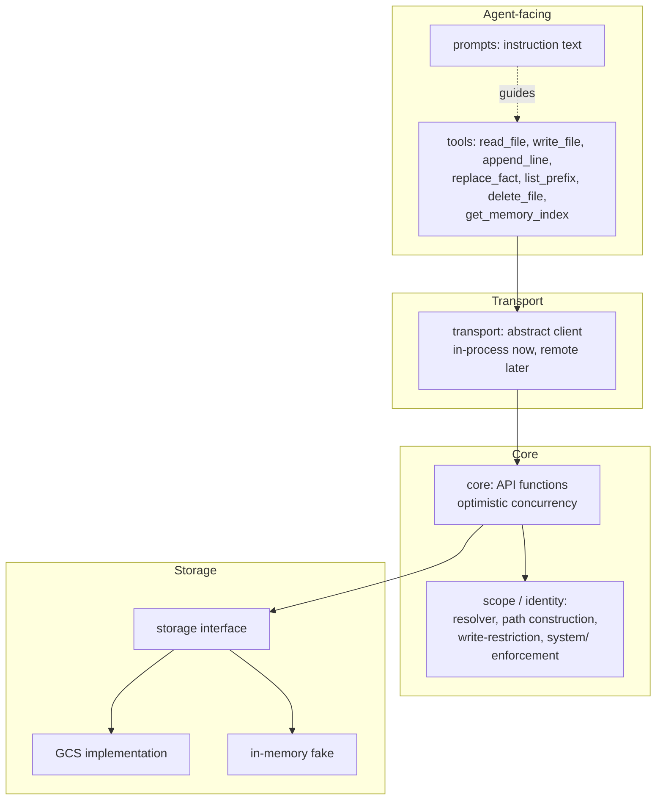

# Architecture

## Bird's-eye view

wenchang gives an AI agent persistent memory: a virtual filesystem of
markdown files, addressed by `{root}/{scope}/{entity_id}/{area}/{name}.md`,
exposed to the agent through a small set of tools (`read_file`, `write_file`,
`append_line`, `replace_fact`, `list_prefix`, `delete_file`,
`get_memory_index`). The library supplies mechanism — storage, concurrency,
authorization — and prompt text describing how to use it well; it enforces
no schema and does not search file content.

Today the repository holds the project skeleton (tooling, tests, docs) plus
three implemented modules: the cross-cutting `errors` and `version_token`,
and the dependency-free `file_format`. The module map below is the intended
shape; each remaining module is marked **(planned)** until implemented.

## Module map

- **errors** — the exception hierarchy every core API function will raise:
  `WenchangError` (base) and one class per category —
  `RecoverableError`, `PermanentError`, `TransientError` — each fixing that
  category's next-action guidance text. Concrete kinds: recoverable
  `VersionConflictError`, `OversizeWriteError`, `ReplaceFactMatchError`,
  `NotFoundError`; permanent `RestrictedScopeError`, `ResolverFailureError`;
  transient `BackendUnavailableError`. See
  [Cross-cutting: error taxonomy](#cross-cutting-error-taxonomy) and
  [ADR 0005](docs/adr/0005-error-taxonomy-as-exceptions.md).
- **version_token** — `VersionToken`, an opaque `NewType` over `str` used
  wherever a caller needs to prove which version of a file it read.
- **file_format** — parsing and serializing a memory file's body and
  metadata, with no dependency on storage, transport, scope, or agent
  frameworks; used by `core` and `storage`. `ConfidenceLabel` (the four
  labels) and `Fact` (label + single-line text), with `parse_fact` /
  `format_fact` converting a single line. `BodyLine` (`Fact | str`) with
  `parse_body` / `serialize_body` converting a whole body losslessly,
  keeping non-fact lines verbatim. `FileMetadata` (description, aliases,
  sources, last-updated) with `metadata_to_map` / `metadata_from_map`
  converting to and from the flat string map stored as GCS custom object
  metadata; malformed input raises `MetadataFormatError`. See
  [ADR 0006](docs/adr/0006-file-format-and-metadata-encoding.md).
- **core** *(planned)* — the core API functions (`read_file`, `write_file`,
  `append_line`, `replace_fact`, `list_prefix`, `delete_file`,
  `get_memory_index`) with optimistic concurrency, built on `file_format`
  and `storage`.
- **storage** *(planned)* — an internal storage protocol mirroring GCS
  object semantics (custom metadata, generation numbers,
  `ifGenerationMatch` preconditions), with a GCS implementation and an
  in-memory fake for unit tests. See
  [ADR 0003](docs/adr/0003-storage-interface-with-in-memory-fake-and-gcs-emulator.md).
- **scope / identity** *(planned)* — the injected identity resolver
  interface (credentials → scope-to-entity-ID map + role per scope), path
  construction, and write-restriction / `system/`-read-only enforcement.
- **transport** *(planned)* — an abstract client interface mirroring the
  core API, with an in-process implementation now and a remote (gRPC)
  implementation later. In-process and remote implementations must be
  behaviorally indistinguishable, verified by a shared conformance suite.
- **tools** *(planned)* — the agent-facing tool layer: thin wrappers over
  the transport client, carrying no policy, each described by a docstring.
- **prompts** *(planned)* — instruction text for filing, deduplication,
  alias upkeep, confidence calibration, write mechanics, curated-content
  correction, applying memory, forgetting, and privacy, plus the
  adopter-configurable slots (scope guidance, seed areas, scope priority,
  systems of record).

`errors` and `version_token` are cross-cutting (imported by every layer
above) and are omitted from the diagram to keep it readable. `file_format`
is dependency-free and used by `core` and `storage`; it is also omitted
from the diagram since it isn't wired into the request path shown there.

## Key invariants

- **Optimistic concurrency via generation.** Every mutating call except
  `append_line` carries an expected version token; a stale token fails the
  call and returns current content plus current version so the caller can
  merge and retry in the same turn. The version token is opaque — no caller
  parses, compares, or orders it.
- **One lock, one token per file.** Content and metadata commit together;
  there is no metadata-only update.
- **The `system/` area is read-only to the agent**, enforced at the tool
  layer as an exact path-prefix check, not by instruction.
- **Metadata-only navigation.** `description` and `aliases` are the entire
  search surface; there is no content search over file bodies.
- **`append_line` carries no version guard** — appends at different offsets
  commute, but a retried append can duplicate a line (acceptable, per the
  error taxonomy).
- **Metadata rides beside the body, never inside it.** The four metadata
  fields are stored as flat string object custom metadata attached to the
  file, committed atomically with the body; the markdown body itself is
  fact lines and tolerated non-fact lines only. The body parser is
  lossless: `serialize_body(parse_body(s)) == s` for every string `s`.

## Cross-cutting: error taxonomy

Errors are categorized by what the agent should do next, not by underlying
cause. Defined in `wenchang.errors` (see [ADR
0005](docs/adr/0005-error-taxonomy-as-exceptions.md)):

- **Recoverable** (`RecoverableError`) — the error carries its own repair
  material (e.g. `VersionConflictError` returns current content and
  version; `OversizeWriteError` returns current size and limit;
  `ReplaceFactMatchError` returns content, version, and match count;
  `NotFoundError` distinguishes an invalid path from a valid path with no
  file yet). The agent corrects and retries in the same turn.
- **Permanent** (`PermanentError`) — stop, do not retry
  (`RestrictedScopeError` for a `system/` write or a role-gated scope;
  `ResolverFailureError` for identity resolution failure).
- **Transient** (`TransientError`) — retry is appropriate
  (`BackendUnavailableError`, distinguishing timeout from unavailability); a
  version-guarded retry safely degrades to a recoverable version conflict if
  the first attempt actually landed.

This taxonomy is expected to apply uniformly across the core API, the
transport layer, and tool-facing error messages.
