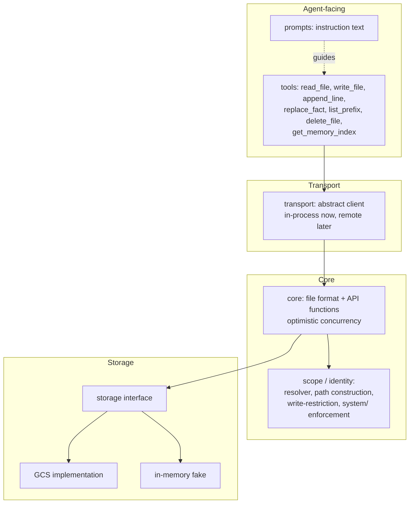

# Architecture

## Bird's-eye view

wenchang gives an AI agent persistent memory: a virtual filesystem of
markdown files, addressed by `{root}/{scope}/{entity_id}/{area}/{name}.md`,
exposed to the agent through a small set of tools (`read_file`, `write_file`,
`append_line`, `replace_fact`, `list_prefix`, `delete_file`,
`get_memory_index`). The library supplies mechanism — storage, concurrency,
authorization — and prompt text describing how to use it well; it enforces
no schema and does not search file content.

Today the repository holds only the project skeleton (tooling, tests,
docs). No library code exists yet. The module map below is the intended
shape; each module is marked **(planned)** until implemented.

## Module map

- **core** *(planned)* — file format: parsing/serializing markdown with its
  four metadata fields (`description`, `aliases`, `sources`,
  `last-updated`) and leading-bracket confidence-label fact lines. Also the
  core API functions (`read_file`, `write_file`, `append_line`,
  `replace_fact`, `list_prefix`, `delete_file`, `get_memory_index`) with
  optimistic concurrency.
- **storage** *(planned)* — an internal storage protocol mirroring GCS
  object semantics (custom metadata, generation numbers,
  `ifGenerationMatch` preconditions), with a GCS implementation and an
  in-memory fake for unit tests. See
  [ADR 0003](docs/adr/0003-storage-interface-with-in-memory-fake-and-gcs-emulator.md).
- **scope / identity** *(planned)* — the injected identity resolver
  interface (credentials → scope-to-entity-ID map + role per scope), path
  construction, and write-restriction / `system/`-read-only enforcement.
- **transport** *(planned)* — an abstract client interface mirroring the
  core API, with an in-process implementation now and a remote (gRPC)
  implementation later. In-process and remote implementations must be
  behaviorally indistinguishable, verified by a shared conformance suite.
- **tools** *(planned)* — the agent-facing tool layer: thin wrappers over
  the transport client, carrying no policy, each described by a docstring.
- **prompts** *(planned)* — instruction text for filing, deduplication,
  alias upkeep, confidence calibration, write mechanics, curated-content
  correction, applying memory, forgetting, and privacy, plus the
  adopter-configurable slots (scope guidance, seed areas, scope priority,
  systems of record).

## Key invariants

- **Optimistic concurrency via generation.** Every mutating call except
  `append_line` carries an expected version token; a stale token fails the
  call and returns current content plus current version so the caller can
  merge and retry in the same turn. The version token is opaque — no caller
  parses, compares, or orders it.
- **One lock, one token per file.** Content and metadata commit together;
  there is no metadata-only update.
- **The `system/` area is read-only to the agent**, enforced at the tool
  layer as an exact path-prefix check, not by instruction.
- **Metadata-only navigation.** `description` and `aliases` are the entire
  search surface; there is no content search over file bodies.
- **`append_line` carries no version guard** — appends at different offsets
  commute, but a retried append can duplicate a line (acceptable, per the
  error taxonomy).

## Cross-cutting: error taxonomy

Errors are categorized by what the agent should do next, not by underlying
cause:

- **Recoverable** — the error carries its own repair material (e.g. a
  version conflict returns current content and version; an oversize write
  returns current size and limit). The agent corrects and retries in the
  same turn.
- **Permanent** — stop, do not retry (e.g. a `system/` write, a
  write-restricted scope, or identity resolution failure).
- **Transient** — retry is appropriate (e.g. timeout or backend
  unavailability); a version-guarded retry safely degrades to a category-1
  conflict if the first attempt actually landed.

This taxonomy is expected to apply uniformly across the core API, the
transport layer, and tool-facing error messages.
