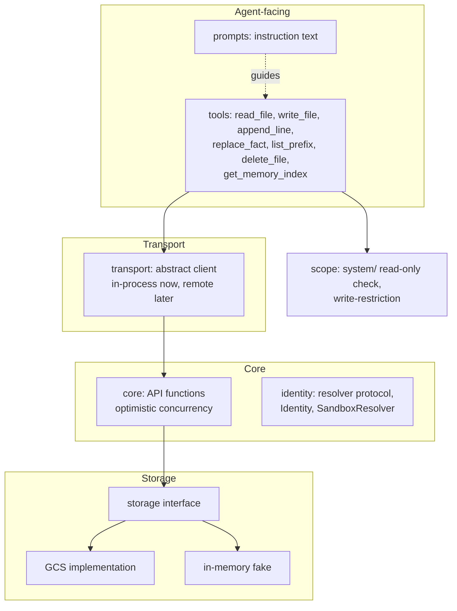

# Architecture

## Bird's-eye view

wenchang gives an AI agent persistent memory: a virtual filesystem of
markdown files, addressed by `{root}/{scope}/{entity_id}/{area}/{name}.md`,
exposed to the agent through a small set of tools (`read_file`, `write_file`,
`append_line`, `replace_fact`, `list_prefix`, `delete_file`,
`get_memory_index`). The library supplies mechanism — storage, concurrency,
authorization — and prompt text describing how to use it well; it enforces
no schema and does not search file content.

Today the repository holds the project skeleton (tooling, tests, docs) plus
eleven implemented modules: the cross-cutting `errors` and `version_token`; the
dependency-free `file_format` and `paths`; the `storage` layer (an in-memory
fake and a GCS implementation behind one protocol); `core`, which
implements all seven core operations (`read_file`, `write_file`,
`replace_fact`, `list_prefix`, `append_line`, `delete_file`, and
`get_memory_index`, with its value types `MemoryIndex` and
`CappedPrefix`); `identity`, the injected identity resolver boundary;
`scope`, the tool-layer write checks (`system/` read-only and role-gated
write restriction); `transport`, the `TransportClient` protocol plus
`InProcessClient`, its in-process implementation; and `tools`, the
agent-facing tool layer, which resolves identity through `identity`,
checks writes through `scope`, and calls a `TransportClient`; and
`prompts`, the instruction text layered over the tools, assembled from
library-owned sections and adopter-supplied slots. Any remote transport is
still planned. A twelfth, `testing`, is adopter-facing rather than part of
the runtime: the executable conformance suites an adopter runs against
their own identity resolver and their own transport client, installed with
the optional `wenchang[testing]` extra. Every module in the map below is
implemented; the remote half of `transport` is the one planned piece.

## Module map

- **errors** — the exception hierarchy every core API function will raise:
  `WenchangError` (base) and one class per category —
  `RecoverableError`, `PermanentError`, `TransientError` — each fixing that
  category's next-action guidance text. Concrete kinds: recoverable
  `VersionConflictError`, `OversizeWriteError`, `ReplaceFactMatchError`,
  `NotFoundError`, `InvalidArgumentError`; permanent `RestrictedScopeError`,
  `ResolverFailureError`; transient `BackendUnavailableError`.
  `InvalidArgumentError(argument, detail)` is raised only by the tool layer
  for a rejected agent-supplied argument. `argument` names it (a non-`str`
  raises `TypeError`, an empty one `ValueError`; a `str` subclass is stored
  as an exact `str`), and `detail` is the composed sentence `Argument
  {argument} is invalid: {detail}`.
  `RestrictedScopeError(path, scope, reason, required_roles: frozenset[str]
  | None = None)` exposes all four as attributes. `required_roles` is the
  set of roles permitted to write the scope. It is checked in this order: a
  non-`None` value whose real type (`issubclass(type(x), frozenset)`, not
  the spoofable `__class__`) is not a `frozenset` raises `TypeError`, so a
  leftover positional `"admin"` is never rendered as a set of characters; a
  non-`str` member raises `TypeError`; the value is then copied to a plain
  `frozenset` of exact `str`s (`str.__str__`), which is what is stored and
  sorted into the message; `ROLE_REQUIRED` with `None` or an empty set
  raises `ValueError`; any other reason with a non-`None` value raises
  `ValueError`. `RestrictionReason` has
  exactly three members: `SYSTEM_READ_ONLY` (the message says the `system/`
  area of the scope is read-only curated content), `ROLE_REQUIRED` (the
  message says the scope is role-gated and lists `required_roles` sorted,
  e.g. `admin, owner`), and `NOT_GRANTED` (the message says the caller's
  identity does not include this entity in the scope). Every message names
  the path and scope. Neither `ROLE_REQUIRED` nor `NOT_GRANTED` echoes the
  caller's own entity ID or role. See
  [Cross-cutting: error taxonomy](#cross-cutting-error-taxonomy),
  [ADR 0005](docs/adr/0005-error-taxonomy-as-exceptions.md), and
  [ADR 0017](docs/adr/0017-write-restriction-enforcement.md).
- **version_token** — `VersionToken`, an opaque `NewType` over `str` used
  wherever a caller needs to prove which version of a file it read.
- **file_format** — parsing and serializing a memory file's body and
  metadata, with no dependency on storage, transport, scope, or agent
  frameworks; used by `core` and `storage`. `ConfidenceLabel` (the four
  labels) and `Fact` (label + single-line text), with `parse_fact` /
  `format_fact` converting a single line. `BodyLine` (`Fact | str`) with
  `parse_body` / `serialize_body` converting a whole body losslessly,
  keeping non-fact lines verbatim. `FileMetadata` (description, aliases,
  sources, last-updated) with `metadata_to_map` / `metadata_from_map`
  converting to and from the flat string map stored as GCS custom object
  metadata; malformed input raises `MetadataFormatError`. See
  [ADR 0006](docs/adr/0006-file-format-and-metadata-encoding.md).
- **paths** — `is_valid_path(path)`, a syntactic check for
  `{scope}/{entity_id}/{area}/{name}.md`: exactly four non-empty segments,
  none `.` or `..`, none containing a backslash or a Unicode control
  character, the last ending in `.md` with a non-empty stem. Paths are
  relative to the storage root; the check never inspects storage or
  interprets the segments (scope validity, authorization) — see [ADR
  0007](docs/adr/0007-core-api-shape-and-storage-layer.md).
  `is_valid_prefix(prefix)` checks 1-3 valid segments (the same segment
  rule as `is_valid_path`), each followed by `/`; the empty prefix is
  invalid. `is_valid_segment(segment)` is the public segment rule both
  use: non-empty, not `.` or `..`, and no `/`, backslash, or Unicode `Cc`
  character. It is also the rule `identity` validates scope names and
  entity IDs with, so an `Identity` can never yield a malformed path; the
  `/` rejection matters only for such unsplit strings, since the path and
  prefix checks split on `/` first. None of the three functions ever raises
  or inspects storage.
  Construction and parsing sit on the same rules. `PathParts(scope,
  entity_id, area, name)` is a frozen value whose `name` excludes the final
  `.md`; it does no validation on construction. `build_path(scope,
  entity_id, area, name)` checks `scope`, `entity_id`, and `area` with
  `is_valid_segment` and accepts `name` iff it is non-empty and
  `is_valid_segment(name + ".md")`, then returns
  `{scope}/{entity_id}/{area}/{name}.md`, always appending `.md` (so `"b.md"`
  yields `b.md.md`, and `"."` / `".."` yield the flat filenames `..md` /
  `...md`). It raises `ValueError(f"invalid {arg}: {value!r}")` naming the
  first bad argument in parameter order. `build_prefix(scope, entity_id=None,
  area=None)` returns `scope/`, `scope/entity_id/`, or
  `scope/entity_id/area/`; only `None` means omitted, and `""` is an invalid
  segment. An `area` without an `entity_id` raises `ValueError("area
  requires entity_id")`, checked before any segment validation; otherwise
  the first bad supplied argument raises as in `build_path`. Every accepted
  result satisfies `is_valid_prefix`. `parse_path(path) -> PathParts` raises
  `ValueError(f"invalid path: {path!r}")` iff `not is_valid_path(path)` and
  strips only the final `.md`. It is the exact inverse of `build_path`:
  `parse_path(build_path(s, e, a, n)) == PathParts(s, e, a, n)` for every
  accepted argument set, and `build_path(**asdict(parse_path(p))) == p` for
  every valid path. Built paths are relative to the storage root and never
  contain `{root}`. `paths` imports nothing from `wenchang`. The builders
  raise `ValueError`, not `NotFoundError`, because they are for values
  library code controls; a caller passing agent-supplied values must
  validate them first or convert the `ValueError` (the tool layer converts
  it into `InvalidArgumentError` naming the bad argument). See
  [ADR 0015](docs/adr/0015-path-construction.md).
- **storage** — an internal protocol mirroring GCS object semantics (custom
  metadata, a generation-backed version token): `Storage` (`get`, `put`,
  `put_if_version`, `delete_if_version`, `list_page`) and `StoredObject`
  (bytes, metadata map,
  `VersionToken`), with two implementations behind it, held identical by one
  shared conformance suite. `InMemoryStorage` is the unit-test fake.
  `GcsStorage` is the only module that imports `google.cloud`; it maps
  client timeouts and server/connection unavailability to
  `BackendUnavailableError`, and pins each `get` to the generation
  `get_blob` fetched so content and metadata always come from the same
  write, retrying on a generation race. `put` is unconditional in both
  implementations. `put_if_version(key, data, metadata, expected)` is the
  conditional put: `expected=None` commits only if no object exists at
  `key` (GCS `ifGenerationMatch=0`); a token commits only if it equals the
  object's current version; any other case raises the storage-internal
  `PreconditionFailedError(key)` and writes nothing. Tokens are compared by
  string equality in `InMemoryStorage`; `GcsStorage` accepts only the
  canonical decimal form of a positive integer as a token (so `"0"` and
  other non-canonical strings fail the precondition locally, with no client
  call, rather than being read as "must not exist"). `delete_if_version(key,
  expected)` is the only delete either implementation offers — there is no
  unconditional delete. It removes the object at `key` only if it is at
  `expected`; if the object is absent or at a different version, it raises
  `PreconditionFailedError(key)` and deletes nothing, the same signal
  `put_if_version` uses for its own precondition failure. `GcsStorage`
  rejects a non-canonical token locally as for `put_if_version`, then calls
  `blob.delete(if_generation_match=...)`; both a GCS `PreconditionFailed`
  (wrong generation) and a `NotFound` (already absent) map to
  `PreconditionFailedError`, and any other backend exception goes through
  `_map_backend_error` like the rest of `GcsStorage`. `list_page(prefix,
  start_after, limit)` returns `ListedObject(key, metadata, version)` for
  keys starting with `prefix` (plain string match), ascending by key, at
  most `limit`, strictly after `start_after` when given (exclusive), never
  reading object bodies; metadata mappings are copies. `InMemoryStorage`
  sorts and slices in memory; `GcsStorage` uses `list_blobs(prefix=...,
  start_offset=start_after, max_results=limit + 1)`, dropping a key equal to
  `start_after` (GCS's `start_offset` is inclusive) before truncating to
  `limit`; call and iteration errors go through the same
  `_map_backend_error` as the rest of `GcsStorage`. See
  [ADR 0003](docs/adr/0003-storage-interface-with-in-memory-fake-and-gcs-emulator.md),
  [ADR 0007](docs/adr/0007-core-api-shape-and-storage-layer.md),
  [ADR 0008](docs/adr/0008-conditional-put-and-write-file-semantics.md),
  [ADR 0010](docs/adr/0010-list-prefix-pagination.md), and
  [ADR 0012](docs/adr/0012-delete-file.md).
- **core** — `MemoryStore(storage, *, max_file_bytes=16384, clock=...,
  list_page_size=100, index_max_bytes=65536, scope_priority=())`,
  holding the core API as methods on one object so operations share
  configuration such as the size limit and index cap; `max_file_bytes`
  must be positive, `clock` (default current UTC) is injectable for tests
  and for stamping `last-updated`, and `list_page_size` (default
  `DEFAULT_LIST_PAGE_SIZE = 100`) must be positive, bounding
  `list_prefix`'s page size. `index_max_bytes` (default
  `DEFAULT_INDEX_MAX_BYTES = 65536`) is the index byte budget and must be
  positive (any value with `<= 0` false is accepted, as for the other
  numeric settings). `scope_priority` (default empty) is the adopter's
  index scope order, exposed with `index_max_bytes` as read-only
  properties. Constructor validation runs every `TypeError` before any
  `ValueError`: `scope_priority` whose real type is `str`, `bytes`, or
  `bytearray` (a bare string is a `Sequence` of its characters), or is not
  a `Sequence` (`issubclass(type(x), Sequence)`, so a spoofed `__class__`
  fails), raises `TypeError`, as does any non-`str` member; members are
  then normalized with `str.__str__` and copied to a tuple, so later
  mutation of a caller's list has no effect. The positivity checks follow,
  then, per normalized member in order, `ValueError("invalid
  scope_priority entry: ...")` if it fails `is_valid_segment` and
  `ValueError("duplicate scope_priority entry: ...")` if already seen.
  `read_file(path) -> MemoryFile` is
  implemented: it validates the path, fetches the object, and returns
  content, metadata, path, and version token. `write_file(path, content,
  metadata, expected_version) -> MemoryFile` is implemented: it validates
  the path, rejects an empty `source` with `ValueError` (checked after the path
  check and before the size check, without consulting storage), and rejects
  content whose UTF-8 encoding exceeds `max_file_bytes` with
  `OversizeWriteError` (checked before storage is consulted). On create
  (`expected_version=None`) it stores `metadata.sources | {source}`. On
  replace it first reads the current object — a missing file raises
  `NotFoundError(FILE_ABSENT)`, a version mismatch seen at that read raises
  `VersionConflictError(path, current_content, current_version)`, and
  corrupt stored metadata propagates `MetadataFormatError` rather than being
  silently overwritten — and stores the union of the stored `sources`,
  `metadata.sources`, and `source`: a caller never has to carry forward
  sources it doesn't know about, and can't remove one another write
  recorded. It then stamps `metadata.last_updated` from the clock
  (overriding the caller's value) and issues one conditional put. On a
  precondition failure at that put it fetches the current object again and
  raises `VersionConflictError(path, current_content, current_version)`, or
  `NotFoundError(FILE_ABSENT)` if the file is now absent; there is no
  automatic re-apply. `replace_fact(path,
  old_string, new_string, expected_version, *, source, aliases=None,
  description=None) -> MemoryFile` is
  implemented: it changes one span of a file's content without the caller
  resending the rest. `old_string` must match a unique anchor — every start
  index counts, so overlapping occurrences (e.g. `"aa"` in `"aaa"`) count
  separately. It reads the current object, counts occurrences of
  `old_string`, and compares that count to 1: at the caller's own
  `expected_version`, any count other than 1 raises
  `ReplaceFactMatchError(path, content, version, count)`; at a stale
  version, a unique match re-applies the edit against the current content
  (absorbing a concurrent write elsewhere in the file), while a non-unique
  match — "genuine overlap," meaning the anchor no longer matches exactly
  once — raises `VersionConflictError(path, content, version)` instead. The
  conditional put is guarded on the version just read, not the caller's
  `expected_version`; a `PreconditionFailedError` re-reads and repeats the
  same check, up to 3 attempts total, after which `VersionConflictError`
  carries the last-read content and version. On success, metadata is
  carried over from the object read on the attempt that commits, with
  `source` unioned into `sources` and `last_updated` stamped from the
  clock; `old_string == ""` or `source == ""` raises `ValueError` before
  storage is consulted. The optional `aliases` and `description` work as
  for `append_line` (below), merged into the metadata of the object read on
  the committing attempt, so a stale-token re-apply unions onto the current
  aliases and its `description` overwrites any committed since the caller's
  read; `new_string == old_string` with either argument is a metadata
  change through the same conditional put. `list_prefix(prefix, cursor=None) -> ListPage` is
  implemented: it returns one page of well-formed memory files under a
  segment-aligned `prefix` as `FileEntry(path, metadata, version)`, in
  ascending path order, without reading any file's content. An invalid
  `prefix` raises `NotFoundError(prefix, INVALID_PATH)` without consulting
  storage. It fetches `list_page_size + 1` keys from `Storage.list_page`
  (decoding `cursor` to a `start_after` key first, if given) so it can tell
  whether a key remains after the page; `ListPage.next_cursor` is `None`
  iff none does. A key under the prefix that isn't a well-formed memory
  path is skipped, so a page can hold fewer than `list_page_size` entries
  while `next_cursor` is still non-`None`; corrupt metadata on a
  well-formed key raises `MetadataFormatError`, and
  `BackendUnavailableError` propagates, exactly as in `read_file`. A
  `ListCursor` is an opaque, URL-safe-base64 encoding of the last key
  examined, validated on decode against the `prefix` it's passed with; a
  malformed cursor or one issued for a different prefix raises `ValueError`.
  Listing is not a snapshot: a file written or deleted between two pages of
  the same listing is reflected at whatever page reads it (or not at all,
  if deleted before its page). `append_line(path, line, expected_version, *,
  source, aliases=None, description=None) -> MemoryFile` is implemented: it
  appends one fact line to the end
  of an existing file's content, only if the file is still at
  `expected_version`. It reads the current object, checks the version,
  inserts a `"\n"` separator first if the content is non-empty and doesn't
  already end in one, and issues one conditional put; `line` must parse as
  exactly one fact line (`parse_fact`) or `ValueError` is raised before
  storage is consulted, as does an empty `source`. A stale `expected_version`
  raises `VersionConflictError(path, current_content, current_version)`
  immediately — unlike `replace_fact`, there is no automatic re-apply,
  since re-applying an append always succeeds and would duplicate a landed
  line on retry. A `PreconditionFailedError` re-reads; if the stored bytes
  and metadata already equal exactly what this call tried to write (its own
  write landed and a backend-level retry of the conditional upload then saw
  the precondition fail), it returns that as success rather than raising or
  writing again, otherwise it raises `VersionConflictError` with the
  current content and version, or `NotFoundError(FILE_ABSENT)` if the
  object is now gone. A missing file raises `NotFoundError(FILE_ABSENT)`
  and is never created. Metadata is stamped the same way as `replace_fact`:
  `source` unioned into `sources`, `last_updated` from the clock. For both
  calls, `aliases: Sequence[str] | None` is unioned into the stored aliases
  (stored aliases first, exactly as stored, then each given alias not
  already present, in order, by exact string equality; never removed), and
  `description: str | None` replaces the stored description; `None` leaves
  a field unchanged. The merged metadata commits in the same conditional
  put as the content. After the existing argument checks, and before
  storage is consulted, a wrongly typed `aliases` (by real type, rejecting
  `str`/`bytes`/`bytearray`), alias member, or `description` raises
  `TypeError`, and a `description` containing `\n` or `\r` raises
  `ValueError` (see [ADR 0024](docs/adr/0024-append-replace-aliases-description.md)).
  `delete_file(path, expected_version) -> None` is
  implemented: it removes the file at `path` only if it is still at
  `expected_version`. It reads the current object, checks the version — a
  mismatch raises `VersionConflictError(path, current_content,
  current_version)` immediately, the file left in place — then issues one
  `delete_if_version`. A `PreconditionFailedError` re-reads to tell a
  conflict from an absence: if the file is now gone it raises
  `NotFoundError(FILE_ABSENT)`, otherwise `VersionConflictError` carrying
  the content and version found on re-read. A missing file (before the
  delete is even attempted) also raises `NotFoundError(FILE_ABSENT)`.
  Unlike every other mutating call, `delete_file` takes no `source` and
  returns `None` — there is no version or content left to hand back for a
  file that no longer exists. It does not parse metadata, so a file with
  corrupt metadata is still deletable. Deleting leaves no tombstone: a
  version token from before a delete is never equal to the token of a file
  later recreated at the same path, since both GCS generations and the
  in-memory fake's counter are monotonic. `get_memory_index(scope_map) ->
  MemoryIndex` is implemented: the session bootstrap, returning merged
  metadata across every scope in a scope-name → entity-ID map, ordered and
  byte-capped, without reading any file's content. It validates
  `scope_map` before any storage call, every `TypeError` before any
  `ValueError`: a value whose real type is not a `Mapping` raises
  `TypeError`; `items()` is read exactly once into a list; for each item in
  that order, one that is not exactly a 2-`tuple` (`type(item) is tuple`
  and length 2) raises `TypeError("scope_map items must be (str, str)
  pairs")`, then a non-`str` key raises `TypeError("scope_map key must be str,
  got ...")` and a non-`str` value `TypeError("scope_map value must be
  str, got ...")`, and both are normalized with `str.__str__`; the
  normalized pairs are sorted by scope; then for each sorted pair
  `ValueError(f"invalid scope: {scope!r}")` or `ValueError(f"invalid
  entity_id: {entity_id!r}")` if it fails `is_valid_segment`, and
  `ValueError(f"duplicate scope: {scope!r}")` for a scope seen twice (a
  `Mapping` whose `items()` repeats a key, or two keys equal after
  normalization), so a lying `Mapping` cannot cause a double fan-out.
  These are `ValueError`, not `NotFoundError`, because the map is a
  library-controlled `Identity.scope_map` (ADR 0015). An empty map returns
  `MemoryIndex()` without touching storage. For each scope in sorted order
  it drains every page under `build_prefix(scope, entity_id)` through the
  base method `MemoryStore.list_prefix(self, prefix, cursor)`, looping
  until `next_cursor is None` and never stopping on an empty page, so
  malformed keys are skipped and corrupt metadata or
  `BackendUnavailableError` propagates unwrapped exactly as in
  `list_prefix`, and a subclass override of `list_prefix` cannot change
  the index. The merged entries are sorted by: `system/` areas across all
  scopes first, decided only by `parse_path(path).area ==
  INDEX_SYSTEM_AREA` (a `core`-local `Final` equal to `"system"`, pinned
  equal to `scope.SYSTEM_AREA` by a test, since `core` must not import
  `scope`), and ignoring `scope_priority`; then non-`system/` entries with
  scopes listed in `scope_priority` as one tier each in list order,
  followed by every unlisted scope as one trailing tier (so the empty
  default is one flat tier, and a listed scope absent from the map is
  ignored); within a tier by `last-updated`, most recent first, keyed on
  the exact integer microsecond offset from the Unix epoch rather than a
  float timestamp; then by path ascending, so the order is total. It sizes
  every ordered entry with `index_entry_bytes` before including any, so an
  unrenderable entry raises `MetadataFormatError` whether or not it would
  fall under the cap. It then includes entries in that order while the running total of
  `index_entry_bytes` stays `<= index_max_bytes` (the cap is inclusive)
  and stops at the first entry that does not fit, never skipping ahead to
  a smaller one, so `entries` is an exact prefix of the full order.
  Everything from that entry on is counted per area prefix
  (`build_prefix(scope, entity_id, area)`) into `capped`, sorted by prefix
  string; the `capped` section's own size is not charged to the budget.
  `index_entry_bytes(entry) -> int` is the public, sole cost rule: the
  UTF-8 length of `entry.path`, plus every key and value of the canonical
  rendering `metadata_to_map(entry.metadata)`, plus `entry.version`, all
  encoded with `errors="surrogatepass"` so a lone surrogate (which
  `is_valid_segment` accepts) is counted rather than raising. It measures
  the library's canonical rendering, not the stored bytes (extra stored
  keys cost nothing; a non-ASCII alias counts its JSON `\uXXXX` escape)
  and not any tool's rendering. An `OverflowError` from re-rendering an
  extreme `last-updated` (e.g. `0001-01-01T00:00:00+05:00`, which
  `metadata_from_map` accepts but cannot be converted to UTC) is raised as
  `MetadataFormatError("last-updated", ...)`. Like listing, the index is
  not a snapshot. The two index value types:
  `CappedPrefix(prefix, omitted)` is a frozen value naming a prefix the
  index could not return in full and how many files under it were left
  out. `MemoryIndex(entries=(), capped=())` is a frozen value holding
  `entries: tuple[FileEntry, ...]` and `capped: tuple[CappedPrefix, ...]`;
  `MemoryIndex()` is the empty index. `entries` is taken as already in load
  order — `system/` areas across all scopes first, then the remaining
  scopes in the configured priority order (or as one tier if none is
  configured), within each tier by `last-updated`, most recent first — and
  is never re-sorted or order-checked; an empty `capped` means the index is
  complete. Both validate at construction, because a remote transport
  client builds them from deserialized data, with every `TypeError` check
  before any `ValueError` check. `CappedPrefix`: a `prefix` whose real type
  (`issubclass(type(x), str)`) is not `str`, or an `omitted` that is a
  `bool` or not an `int`, raises `TypeError` (so `CappedPrefix("", True)`
  is a `TypeError`); `prefix` is then stored as an exact `str`
  (`str.__str__`) and `omitted` as an exact `int` (`int.__index__`), and
  the value checks run on those normalized values, so a subclass with a
  lying `__le__` cannot store a non-positive count; a prefix failing
  `is_valid_prefix` or `omitted <= 0` raises `ValueError`. `MemoryIndex`
  requires exact types throughout: a field whose type is not exactly
  `tuple` (a `list` or a `tuple` subclass) raises `TypeError`, as does any
  member whose type is not exactly `FileEntry` or `CappedPrefix`
  respectively (`type(x) is ...`), so subclasses are rejected rather than
  normalized, since a subclass could lie through `__iter__`,
  `__getattribute__`, `__eq__`, or `__hash__` and defeat the duplicate
  checks or equality; two entries sharing a `path` or two capped members
  sharing a `prefix` then raise `ValueError`. Only the two `CappedPrefix`
  scalars use real-type checks plus normalization. Member contents are not
  validated beyond that (a `FileEntry`'s fields, including a `str`-subclass
  `path`, are taken as given). Type names in these messages are read
  through a guarded helper that reports `<unnamed>` if `__name__` raises
  or is not a `str`. Equality and hashing are the dataclass defaults.
  See
  [ADR 0007](docs/adr/0007-core-api-shape-and-storage-layer.md),
  [ADR 0008](docs/adr/0008-conditional-put-and-write-file-semantics.md),
  [ADR 0009](docs/adr/0009-replace-fact-semantics.md),
  [ADR 0010](docs/adr/0010-list-prefix-pagination.md),
  [ADR 0011](docs/adr/0011-append-line-version-guard.md),
  [ADR 0012](docs/adr/0012-delete-file.md),
  [ADR 0013](docs/adr/0013-write-file-source.md),
  [ADR 0019](docs/adr/0019-transport-client-interface.md),
  [ADR 0020](docs/adr/0020-memory-index-and-in-process-client.md), and
  [ADR 0024](docs/adr/0024-append-replace-aliases-description.md).
- **identity** — the injected-dependency boundary through which the
  library learns who the caller is; it has no notion of users,
  organizations, or roles of its own, and imports only `errors` and
  `paths`. Every `str`-typed value (scope keys, `entity_id`, `role`,
  `detail`) is normalized to an exact `str` via `str.__str__` before
  validation and storage, so a `str` subclass cannot defeat the segment
  rule. `ScopeGrant(entity_id, role)` is a frozen value: a non-`str`
  field raises `TypeError`, an `entity_id` failing `is_valid_segment` or an
  empty `role` raises `ValueError`. `Identity(grants)` holds one
  `ScopeGrant` per scope name; a non-`Mapping` raises `TypeError`, otherwise
  it snapshots the caller's mapping exactly once, type-checks and validates
  every key (`is_valid_segment`) and value (`issubclass(type(grant),
  ScopeGrant)`, so a spoofed `__class__` is rejected) of that snapshot,
  raises `ValueError` for keys that collide after normalization, and stores
  it as a read-only `MappingProxyType`, so neither the caller's mapping nor
  item assignment can change it. It exposes `scope_map` (a fresh scope →
  entity-ID dict each call), `entity_id(scope)`, and `role(scope)` (both
  raise `KeyError` for an ungranted scope); `"s" in identity.grants` and
  `grants.get` are the non-raising lookups. It is equal and hashable by
  content regardless of insertion order, and defines `__reduce__` to
  rebuild through `type(self)`'s constructor so `pickle` and
  `copy.deepcopy` work and preserve subclasses; `dataclasses.asdict` is
  unsupported. An empty `Identity` is valid. `ResolutionFailure(detail)`
  (a non-`str` `detail` raises `TypeError`, an empty one `ValueError`;
  shown to the agent, must never carry credentials) is how a resolver
  reports failure.
  `IdentityResolver[C]` is a runtime-checkable `Protocol`, generic and
  inferred contravariant in the credentials type, with one method
  `resolve(credentials: C) -> Identity | ResolutionFailure` that must not
  raise. `resolve_identity(resolver, credentials) -> Identity` is the
  library's only call into a resolver. It type-tests the result with
  `issubclass(type(result), ...)`, never the resolver-controlled
  `__class__`: a returned `Identity` is returned as the same object; a
  `ResolutionFailure(d)` raises `ResolverFailureError(d)`, built inside a
  guard that falls back to a message naming the resolver class if reading
  or formatting `d` raises; type names in messages are read through a
  guarded helper that reports `<unnamed>` if `__name__` raises;
  a raised `Exception` (including any `WenchangError`) raises a new
  `ResolverFailureError` naming only the resolver class and exception type,
  raised `from None`; every `ResolverFailureError` is raised `from None`
  outside any handler, so no resolver exception is its `__cause__` or
  `__context__`; any other return raises `ResolverFailureError` naming the
  resolver class and returned type; a `BaseException` that is not an
  `Exception` propagates unchanged. Credentials are never inspected,
  stored, or included in an error. `SandboxResolver(identity)` returns the
  adopter-supplied `identity` for any credentials and satisfies
  `IdentityResolver[C]` for every `C`. See
  [ADR 0014](docs/adr/0014-identity-resolver.md).
- **scope** — write restrictions enforced at the tool layer. It imports
  only `errors`, `identity`, and `paths`, never `core` or `storage`, and
  `core` never imports it: the tool layer calls it before calling `core`,
  and `MemoryStore` applies none of its checks, so the seeding job and admin
  tooling can still write `system/` and restricted scopes through `core`.
  Every check is a pure function over an already-resolved `Identity`; none
  consults storage or a resolver. Only writes are checked: reads and
  listing are never checked, including reads of scopes or entities the
  caller is not granted. `check_not_system`, `check_write_allowed`, and
  `check_write` each reject a non-`str` path with `TypeError` and normalize
  a `str` subclass to an exact `str` (`str.__str__`) at entry, before any
  parsing, so a subclass with a lying `split` or `__ne__` cannot mislead
  the checks. Error `path` attributes carry that exact `str`.
  `SYSTEM_AREA` is the `Final` constant
  `"system"`. `is_system_path(path) -> bool` is True iff
  `is_valid_path(path)` and the path's area segment (from `parse_path`)
  equals `SYSTEM_AREA` exactly; it never raises, returning False for a
  non-`str` or a malformed path. `check_not_system(path) -> None` raises
  `NotFoundError(path, INVALID_PATH)` for a malformed path first, the same
  error `core` gives, and then `RestrictedScopeError(path, scope,
  SYSTEM_READ_ONLY)` naming the path's first segment as the scope if the
  area equals `SYSTEM_AREA`; otherwise it returns `None`. The match is exact
  string equality with no case folding, Unicode normalization, or prefix
  match, and only the area position counts, so a scope, entity ID, or name
  called `system` is unrestricted. It takes `path` as its only parameter,
  with no identity, role, or bypass argument, so no caller can be exempted.
  `ScopePolicy(write_roles: Mapping[str, frozenset[str]])` is the adopter's
  scope configuration, mapping each write-restricted scope to the roles
  permitted to write it. A scope absent from `write_roles` is unrestricted:
  any granted role may write it. Keys match the resolver's grant keys and
  the path's scope by exact string equality, so a key that matches no
  resolver scope (misspelled, differently cased) restricts nothing, and no
  scope name, `system` included, is special-cased. Construction checks, in
  order, raising on the first failure: a non-`Mapping` raises `TypeError`;
  then for each entry in iteration order, all of one entry's checks before
  the next's, a non-`str` scope name raises `TypeError`, a scope failing
  `is_valid_segment` raises `ValueError`, a role set whose real type
  (`issubclass(type(x), frozenset)`) is not a `frozenset` (a `set`, `list`,
  or `str` included) raises `TypeError`; the role set is then copied into a
  real `frozenset` before the remaining checks, so a subclass with a lying
  `__len__` or `__iter__` cannot store an empty set; an empty role set
  raises `ValueError`, a non-`str` role raises `TypeError`,
  an empty role `""` raises `ValueError`, and a scope that collides with an
  earlier one after `str` normalization raises `ValueError`. Scope names and
  roles are normalized to exact `str` via `str.__str__`, as in `identity`.
  The caller's mapping is read exactly once and stored as a read-only
  `MappingProxyType`, so neither later mutation of the source nor item
  assignment changes the policy. It is equal and hashable by content
  regardless of insertion order, and defines `__reduce__` so `pickle` and
  `copy.deepcopy` rebuild through the constructor; `ScopePolicy({})` is
  valid and restricts nothing. `is_write_restricted(scope)` and
  `permitted_roles(scope)` (the set, or `None` if unrestricted) are its
  lookups.
  `check_write_allowed(path, identity, policy) -> None` checks grant and
  role only: a malformed path raises `NotFoundError(path, INVALID_PATH)`; a
  path whose scope has no grant in `identity`, or whose entity ID differs
  from that grant's entity ID, raises `RestrictedScopeError(path, scope,
  NOT_GRANTED)`, whether or not the scope is restricted; a restricted scope
  whose permitted set lacks the grant's role raises
  `RestrictedScopeError(path, scope, ROLE_REQUIRED,
  required_roles=<the policy's set>)`. Roles compare by exact,
  case-sensitive string equality, with no hierarchy. It deliberately skips
  the `system/` check, so it is for testing each check alone and for admin
  tooling; tool code must not call it. `check_write(path, identity, policy)
  -> None` is the tool-layer entry point, called before every mutating call:
  it normalizes the path once and hands the same exact `str` to
  `check_not_system`, then `check_write_allowed`, so both sub-checks see
  identical input and the first
  failure wins in the order invalid path, `system/`, not granted, role. See
  [ADR 0016](docs/adr/0016-system-read-only-enforcement.md) and
  [ADR 0017](docs/adr/0017-write-restriction-enforcement.md).
- **testing** — adopter-facing conformance suites, not part of the runtime
  request path. `wenchang.testing.ResolverConformance[C]` is a pytest mixin,
  generic in the credentials type, of twelve test methods; passing all of
  them defines a conforming `IdentityResolver[C]`. Its name does not start
  with `Test`, so pytest never collects the mixin itself; an adopter
  subclasses it as `class TestMyResolver(ResolverConformance[MyCreds])` and
  supplies six required fixtures: `resolver` (`IdentityResolver[C]`),
  `valid_credentials` (`C`), `invalid_credentials` (`C`), `policy`
  (`ScopePolicy`), `expected_scopes` (`frozenset[str]`, exactly the scopes
  `valid_credentials` must grant), and `known_roles` (`frozenset[str]`,
  every role the resolver may return). A missing fixture is a pytest
  collection error. `expected_scopes` and `known_roles` are checked to be
  `frozenset`s of exact `str` before use. The methods, by Notion §10.1 clause:
  valid credentials resolve to an `Identity` —
  `test_valid_credentials_resolve_to_identity`,
  `test_valid_credentials_resolve_through_library_entry_point`; never
  raises on bad credentials, and the library converts the failure to a
  permanent error — `test_invalid_credentials_return_resolution_failure`,
  `test_invalid_credentials_raise_permanent_resolver_failure_error`;
  consistent within a session (three resolves of the same credentials
  object, compared by value; invalid-credential `detail` may differ) —
  `test_valid_resolution_is_consistent`,
  `test_invalid_resolution_is_consistent`; roles are decidable (every
  granted role and every role the policy permits is in `known_roles`) —
  `test_roles_are_known_to_scope_configuration`. By the issue's enforcement
  clauses, run end-to-end on the adopter's identity and policy: path
  construction — `test_granted_scopes_build_valid_paths`; `system/`
  read-only — `test_system_area_is_read_only_in_every_scope`; write
  restriction, own entity — `test_own_entity_writes_follow_policy` (returns
  `None` or raises `ROLE_REQUIRED` with the policy's role set, as the policy
  predicts), foreign entity — `test_foreign_entity_writes_are_not_granted`,
  ungranted scope — `test_ungranted_scope_writes_are_not_granted`. Contract
  checks call `resolver.resolve` directly, so a raising resolver fails
  rather than being masked by `resolve_identity`; `resolve_identity` is
  called only to check the conversion. The suite judges the values the
  library reads, not the resolver's own objects: every resolved `Identity`
  (and the `resolve_identity` result) is canonicalized to a base `Identity`
  of base `ScopeGrant`s rebuilt from the stored grants' `entity_id` and
  `role`, and any `Exception` while rebuilding fails with key phrase
  `invalid Identity`. Every later comparison and read uses that canonical
  value, so an `Identity` or `ScopeGrant` subclass with a lying `__eq__` or
  overridden `role()` / `entity_id()` cannot pass. Result types are tested
  by real type (`issubclass(type(result), ...)`), so a spoofed `__class__`
  fails as the wrong type. Resolver and exception type names are read
  through a guarded helper that reports `<unnamed>` if `__name__` raises.
  `expected_scopes` and `known_roles` are copied to plain `frozenset`s of
  exact `str`, and a bad member's type is named. Every violation is reported with
  `pytest.fail`, never `assert`, with a message naming the resolver class
  and containing a fixed key phrase (e.g. `must not raise`, `wrong
  reason`); a caught exception stays attached as the failure's implicit
  context so pytest shows it. This deliberately contrasts with the
  library's own `from None` rule in `resolve_identity`: here the adopter is
  debugging their own resolver with their own test credentials. A resolver
  that accepts every credential (such as `SandboxResolver`) has its
  `invalid_credentials` fixture call `pytest.skip`, which skips exactly the
  three methods taking it. The module applies no pytest marks. It imports
  `errors`, `identity`, `paths`, and `scope`, plus `pytest`; nothing in the
  library imports it. It requires the `wenchang[testing]` extra
  (`testing = ["pytest>=8.3"]` under `[project.optional-dependencies]`). See
  [ADR 0018](docs/adr/0018-resolver-conformance-suite.md).
  `wenchang.testing.TransportConformance` (in
  `wenchang.testing.transport_conformance`) is the same shape for a
  `TransportClient`: a non-generic pytest mixin, not `Test`-prefixed,
  subclassed as `class TestMyClient(TransportConformance)` with seven
  required fixtures: `client` (a fresh `TransportClient` over an empty
  store, per test; checked by reading each of the seven method names, each
  of which must exist, be readable, and be callable, with a failure naming
  the method, and then by `isinstance(client, TransportClient)` run inside
  a guard, so a client whose `__class__` raises fails rather than errors),
  `source` (a non-empty exact `str` passed as `source=`), `scope_map` (a
  `Mapping`, by real type, of at least two distinct scopes to entity IDs,
  every key and value an exact `str` passing `is_valid_segment`; an
  `items()` that raises or repeats a key fails), and the values the
  client's store was configured with: `max_file_bytes` (an exact `int` of
  at least `MIN_FILE_BYTES = 64`), `index_max_bytes` (an exact `int` of
  at least `MIN_INDEX_BYTES = 1024`), `list_page_size` (an exact positive
  `int`; `bool` rejected for all three), and `scope_priority` (an exact `tuple` of distinct
  exact-`str` valid segments, even though `MemoryStore` accepts any
  `Sequence`). Fixtures are validated in that fixed order, so the first bad
  one is reported, with key phrase `fixture <name>`;
  `test_client_satisfies_protocol` takes all seven and validates them all,
  so every fixture is required from the first run even though only later
  cases use the last three. The fixture contract also requires that every
  mapped scope be writable through `client` under the credentials it was
  constructed with, and that a client's writes stamp strictly increasing
  `last_updated` within one test (the repo's reference run uses a ticking
  clock). Cases call the client sequentially; concurrency is modeled as
  sequential interleavings on one client, so no thread safety is required.
  Five baseline methods ship: `test_client_satisfies_protocol` (all seven
  fixtures, including the client's method and protocol checks),
  `test_write_then_read_round_trips` (content and all four metadata fields;
  `source` must be unioned into `sources`),
  `test_returned_token_is_accepted` (a token from a read is accepted back
  by `write_file`, and one from a write by `append_line`),
  `test_read_absent_is_not_found`, and `test_oversize_write_is_rejected`
  (`OversizeWriteError` with `size` and `limit`, then the path still reads
  as absent). On top of these, 43 case methods cover all nine §10.2
  groups, one method per assertion, each self-contained (own writes, own
  probe paths): round-trip fidelity (unicode, fact-like markdown, no
  trailing newline, empty content, empty aliases with many sources, a
  replace whose sources accumulate), atomicity (a stale replace leaves
  content and metadata together; a delete removes both; an append moves
  content and `last_updated` together), version token opacity (tokens from
  every operation and from index entries are accepted when handed back),
  conflict semantics (stale write and stale delete conflict carrying the
  current content, and the carried token is accepted; create-on-existing
  conflicts; a token on an absent path is `FILE_ABSENT`), replace-fact
  matching (zero and multiple matches carry `match_count` and content; a
  stale token re-applies a still-unique match and conflicts otherwise),
  append guarding (two appends at one token: one lands, one conflicts, no
  duplication; separator rule; no creation on an absent path), enforcement
  (oversize append and `replace_fact` rejected with the exact UTF-8 size
  of the would-be content; a `system/` write *accepted* at the transport),
  index behavior (fan-out over every scope; `system/` first, then
  `scope_priority` tiers, each by recency; the byte cap; an empty map
  gives `((), ())`), listing (pagination at `list_page_size` with stable
  cursors in ascending path order, entity and scope levels, invalid
  prefix, malformed and foreign cursors), and error parity (invalid path
  and absent file for every operation, empty `source` per method, full
  `str(exc)` equal to a locally built core error and ending with the
  category guidance, `get_memory_index` argument errors). Six more cases
  cover `append_line`/`replace_fact`'s optional `aliases` and
  `description`: the alias union and description replacement, in both the
  returned file and a read-back, for each method; omitted and explicit-`None`
  arguments leaving metadata unchanged; a stale-token `replace_fact`
  re-apply unioning onto the current aliases; and argument errors (a `str`
  `aliases`, a non-`str` alias, and a non-`str` `description` raise
  `TypeError`, checked by type only; a newline `description` raises
  `ValueError` with core's exact text, `MSG_DESCRIPTION_NEWLINE`), leaving
  the file unchanged. The index cap
  case replays core's rule over entries the client returned (sized with
  `index_entry_bytes` and `sentinel_entry_bytes`, never hardcoded),
  writing up to 20 files under area `INDEX_AREA = "conformance-index"`
  until the replay omits one of them, and asserts the exact longest
  fitting prefix and the exact `capped`; it skips only if 20 files never
  overflow (the reference fixture does not). Argument-error `ValueError`s
  pin core's exact text through module constants (`MSG_WRITE_ARGS`,
  `MSG_REPLACE_ARGS`, `MSG_APPEND_ARGS`, one per method where core shares a
  message across causes, plus `MSG_MALFORMED_CURSOR`,
  `MSG_FOREIGN_CURSOR`, `MSG_INVALID_SCOPE`, `MSG_INVALID_ENTITY`,
  `MSG_DESCRIPTION_NEWLINE`), and a
  drift test in the repo's tests provokes every (method, cause) pair on a
  real `MemoryStore` and requires `str(exc)` to equal the constant.
  `get_memory_index`'s `TypeError`s (non-`Mapping` map, non-`str` key or
  value) and the `aliases`/`description` `TypeError`s are checked by type
  only, since their text names caller-side
  types a remote may reject at serialization in its own words. Two
  behaviors are out of the suite: duplicate scopes in `scope_map`
  (unbuildable with a real `Mapping`, and legitimately collapsed by a
  remote that serializes to JSON) and corrupt-metadata parity
  (`MetadataFormatError`, `UnicodeDecodeError`), which a conforming client
  cannot provoke because it cannot seed corrupt stored data; corrupt
  stored metadata is covered by core's `read_file`/`list_prefix` tests and
  the storage conformance suite, and the tool layer passes
  `MetadataFormatError` through. Calls on absent or malformed paths
  hand back `_ABSENT_TOKEN = VersionToken("1")`, a plain module constant,
  since any token there must yield `NotFoundError`; every other token
  reaches the client only as an argument to a `client.<method>(...)` call
  written inside the lambda passed to `_call` or `expect_error`, and no
  helper takes a token parameter, so the token scan needs no exemption.
  The cases are built from public module-level helpers:
  `require_fresh`, `sentinel_path`, `without_sentinel`,
  `sentinel_entry_bytes`, `probe_path`, `expect_error`, `canonical_file`,
  `canonical_entry`, `canonical_page`, `canonical_index`, and the
  `check_*` fixture checks. Every failure goes through `pytest.fail`; every
  message except a fixture check's has the form `name: label: phrase`,
  where `name` is the client class (read through the guarded `<unnamed>`
  helper) and `label` names the call or result under check (e.g.
  `read_file(<path>)`, `write result for <path>`), so a failure says which
  call fired. Every client call a case makes runs under `expect_error` or a
  private `_call` wrapper that turns any `Exception` into `unexpected
  error`, so no raw exception escapes a case. Isolation: every stateful
  case first calls `require_fresh`, which fails with `not isolated`
  (naming the type the read returned) if a sentinel file already exists
  and otherwise writes it; the sentinel is at
  `build_path(first, scope_map[first], "conformance-sentinel", "sentinel")`
  where `first` is the first scope in sorted order, i.e. under the caller's
  own entity in a writable scope, in an area no case uses for data. So a
  `client` fixture shared across tests fails on the second stateful case in
  any order. Because entity- and scope-level listings and the index do see
  the sentinel, later cases filter it with `without_sentinel` (entries,
  and for a `MemoryIndex` also its `CappedPrefix`, rebuilding the index
  under `_call` so a malformed index fails rather than raising
  `ValueError`) and budget it with
  `sentinel_entry_bytes`, which lists the sentinel through the client and
  returns `index_entry_bytes` of the returned `FileEntry`. Version tokens
  are never compared, not even for equality, ordered, sliced, or passed to
  anything but the client's own methods and `type()`: a remote may return
  different but equivalent token strings, so a token is checked only by
  shape (`type(v) is str and v`) and by handing it back. An `ast` scan in
  the repo's tests pins this rule against the module, including method
  calls on a token and f-string interpolation of one. `last_updated` is
  compared only between two results the same client returned in one test
  (the write result and the read result), never with the test's clock.
  The canonical readers check every nested field of a client-returned
  `MemoryFile`, `FileEntry`, `ListPage`, or `MemoryIndex` by exact type
  (`FileMetadata`, `tuple` of `str` aliases, `frozenset` of `str` sources,
  aware `datetime`, `CappedPrefix` members with exact `str` prefix and
  `int` omitted, `str | None` cursor), failing with `wrong result type` or
  `bad field <name>`. Every attribute read is guarded, so a field that
  raises on read fails `bad field <name>: unreadable` rather than escaping
  as an error. `last_updated` is converted to UTC inside the same guard as
  its offset check (any failure is `bad field last_updated: offset
  unreadable`), so later comparison and formatting never run client
  `tzinfo` code, and equal instants at different offsets compare equal.
  The readers return plain tuples that omit the version; this is the
  cross-transport parity check for
  those types that ADR 0019 deferred to the suite. `expect_error(name,
  label, call, expected, category, /, *, message=None, **payload)` is the
  one error-parity helper: the raised type must be exactly `expected` (a
  subclass or a spoofed `__class__` fails), `category` is required for a
  `WenchangError` subclass and must be `None` otherwise (`harness
  misuse`), `message` if given must equal `str(exc)`, and each payload
  attribute is compared by exact type and then value, so a plain `str`
  never stands in for a `StrEnum` reason. For §10.2's enforcement bullets
  (`system/` writes and role-restricted writes) the human decided option
  (a) on 2026-10-02, recorded in ADR 0021: the transport suite asserts such
  writes are accepted at the transport
  (`test_system_area_write_is_accepted_at_transport`), and enforcement is
  tested only by the tool-layer and resolver suites. The repo checks the
  suite itself: a method-name test pins the exact set of public cases, the
  reference run against `InProcessClient` passes with no skips, and each
  §10.2 group has a broken-client self-test that fails with the expected
  phrase and label. It imports `core`, `errors`, `file_format`, `paths`,
  `transport`, and `version_token` from `wenchang`, plus `pytest`, applies
  no pytest marks, and cites no Linear IDs. See
  [ADR 0021](docs/adr/0021-transport-conformance-harness.md),
  [ADR 0023](docs/adr/0023-transport-conformance-cases.md), and
  [ADR 0024](docs/adr/0024-append-replace-aliases-description.md).
- **transport** — the transport-agnostic client contract the tool layer
  calls, so a transport is added by writing another implementation without
  touching tool definitions. `TransportClient` is a runtime-checkable,
  synchronous `Protocol` of exactly seven methods: `read_file`,
  `write_file`, `append_line`, `replace_fact`, `list_prefix`,
  `delete_file`, and `get_memory_index(scope_map: Mapping[str, str]) ->
  MemoryIndex`. All seven `MemoryStore` methods mirror it exactly —
  parameter names, kinds, defaults, annotations, and return type,
  including keyword-only `source`, `append_line`/`replace_fact`'s
  keyword-only `aliases: Sequence[str] | None = None` and `description: str
  | None = None`, and `list_prefix`'s `cursor: ListCursor | None = None` —
  pinned by a test comparing
  `inspect.signature(..., eval_str=True)` of each pair, so the tool layer is
  written once and an in-process client can be a pure pass-through. The
  module therefore has no `from __future__ import annotations` and imports
  its annotation types at module level, never under `TYPE_CHECKING`.
  `runtime_checkable` checks method presence only; signatures are held by
  that test and pyright, behavior by the conformance suite. The class
  docstring states the error-parity contract: for well-typed arguments,
  each mirrored method raises exactly the exception types the matching
  `MemoryStore` method raises, with equal attributes and message — the
  `wenchang.errors` taxonomy (same category and payload) and the
  non-taxonomy types core raises, including `ValueError` (empty `source` or
  `old_string`, non-fact `line`, a `description` containing a newline or
  carriage return, malformed or foreign `cursor`),
  `MetadataFormatError`, and `UnicodeDecodeError`. A client never reshapes
  an error into its own vocabulary or lets a transport library's exception
  escape; a failure of the transport itself (timeout, refused connection,
  crashed server) surfaces as `BackendUnavailableError` with the matching
  `TransientReason`. Wrongly typed arguments (including a wrongly typed
  `aliases` or `description`) are outside the contract.
  `get_memory_index` follows `MemoryStore.get_memory_index` the same way.
  The protocol is identity-agnostic: `scope_map` is the plain
  `Identity.scope_map` shape, and no method carries identity or
  credentials. The tool layer resolves identity and calls
  `scope.check_write` before any mutating client call; a remote client
  binds whatever it authenticates with at construction (per session or
  connection), never per call. The transport accepts every well-formed
  write, including one under `system/`; scope enforcement happens only in
  the tool layer, and a remote server must not enforce scope at the
  transport. It imports from `wenchang` only `core`
  (including `MemoryStore`), `file_format`, and `version_token`, and `core`
  never imports it. `InProcessClient(store)` is the in-process
  implementation, calling the wrapped `MemoryStore` directly with no
  network hop: each of the seven methods has the protocol's exact
  signature (pinned by the same `inspect.signature` test), forwards its
  arguments unchanged, returns the store's result object itself (except
  `delete_file`, which always returns `None`, even if a store subclass
  returns a value), and lets every exception propagate as raised, adding
  no `__cause__` or `__context__`. It adds no caching, retry, or validation
  beyond its constructor, which raises `TypeError` unless the argument's
  real type is a `MemoryStore` (`issubclass(type(x), MemoryStore)`; a
  subclass is accepted, a spoofed `__class__` is not), naming the type
  through a guarded helper that reports `<unnamed>` if `__name__` raises;
  the `store` property returns the
  wrapped store. `MemoryStore` itself also satisfies `TransportClient`
  structurally, so a host may pass either. `tools` calls the protocol; any
  remote transport is planned. The transport conformance suite
  (`testing.TransportConformance`) is complete: its baseline cases and the
  exhaustive cases for all nine §10.2 groups run against `InProcessClient`
  in the repo's tests with no skips, and define what a future remote client
  must pass. See
  [ADR 0019](docs/adr/0019-transport-client-interface.md),
  [ADR 0020](docs/adr/0020-memory-index-and-in-process-client.md),
  [ADR 0021](docs/adr/0021-transport-conformance-harness.md),
  [ADR 0023](docs/adr/0023-transport-conformance-cases.md), and
  [ADR 0024](docs/adr/0024-append-replace-aliases-description.md).
- **tools** — the agent-facing tool layer: thin verbs over a
  `TransportClient`, carrying no judgment. The description a host shows
  the agent for each tool comes from `descriptions()` (below), built from
  the tool's docstring. The mechanics every tool shares (what `scope`, `area`, and
  `name` mean, the `.md` exclusion, the slug rule, `system/` being
  read-only, capped paging) are stated once, in the `get_memory_index`
  docstring; each mutating tool's docstring keeps its own one-sentence
  version-conflict rule, since a host that loads tool schemas on demand
  may show it alone (see
  [ADR 0025](docs/adr/0025-prompt-layer-sections-and-slots.md) decision
  11). `MemoryTools(client, identity, policy, *, source, product=None)`
  is one session: a resolved `Identity`, the adopter's `ScopePolicy`, the
  client, the calling surface's name, stamped as `source` on every write
  and not settable by the agent, and optionally the product the memory
  serves. Constructor arguments are adopter-side, checked in argument
  order: a client failing `isinstance(..., TransportClient)`, an
  `identity` or `policy` of the wrong real type, a non-`str` `source`, or
  a `product` that is neither `str` nor `None` raises `TypeError`; an
  empty `source`, or a `product` that after `str.__str__` and `str.strip`
  is empty, spans more than one line (any `str.splitlines` boundary), or
  is not UTF-8 encodable, raises `ValueError`. All five are read-only
  properties. `bind_tools(client, resolver, credentials, policy, *,
  source, product=None)` is the only function in the layer that takes
  credentials: it passes them to `resolve_identity` and returns a
  `MemoryTools`, retaining nothing; a resolution failure is the permanent
  `ResolverFailureError`, raised before `source` or `product` is checked.
  A host serving many sessions binds one `MemoryTools` per session; the
  client may be shared.
  The seven tools are methods. `TOOL_NAMES` is `("get_memory_index",
  "read_file", "list_prefix", "write_file", "append_line", "replace_fact",
  "delete_file")`, and `tools()` returns a fresh read-only mapping from
  each name to its bound method, in that order, for a host to decorate.
  `descriptions()` returns a fresh read-only mapping from the same names,
  in the same order, to each tool's description, and a host registers each
  tool with `descriptions()[name]` rather than `__doc__`. With `product`
  `None` a description is the `inspect.cleandoc`'d docstring. With a
  product, only the first line changes: it comes from a fixed per-tool
  template that is the docstring's first line with the product inserted
  (plus "memory" for `list_prefix`), e.g. "Add one fact line to the end of
  an existing Mixpanel memory file."; the remaining lines are the
  docstring's. No tool method takes `product`, and the docstrings are
  static (see [ADR 0026](docs/adr/0026-product-identity.md)).
  Tools are scope-relative: `read_file(scope, area, name)`,
  `write_file(scope, area, name, content, description, aliases,
  expected_version)`, `append_line(scope, area, name, line,
  expected_version, aliases=None, description=None)`, `replace_fact(scope,
  area, name, old_string, new_string, expected_version, aliases=None,
  description=None)`, `delete_file(scope, area, name,
  expected_version)`, and `list_prefix(scope, area=None, cursor=None)`. No
  tool accepts a path, prefix, or entity ID. The tool builds the path with
  `build_path(scope, entity_id, area, name)` (or `build_prefix(scope,
  entity_id, area)`), where `entity_id` is `identity.grants[scope].entity_id`
  read directly, never through `Identity.entity_id()`, which a subclass
  could override. `name` excludes `.md`, which `build_path` always appends.
  So reads and listing reach only the caller's own entity in each granted
  scope; shared content lives under a scope's entity the caller is granted.
  `get_memory_index()` takes no arguments and passes a scope map built from
  the grants (`{s: g.entity_id for s, g in grants.items()}`), never the
  overridable `Identity.scope_map` property.
  `write_file` exposes only `description` and `aliases` of the metadata:
  it builds `FileMetadata(description, tuple(aliases), frozenset(),
  <1970-01-01 UTC>)`, and core stamps `last_updated` and unions `source`
  into `sources`. `append_line` and `replace_fact` take optional `aliases`
  and `description` (positional-or-keyword with `None` defaults, like
  `list_prefix`'s), validated by the same `_aliases` and `_description`
  helpers as `write_file`'s and forwarded to the client as an exact `tuple`
  of `str` and an exact `str`, or `None`; core unions the aliases and
  replaces the description, so only `write_file` removes an alias (see
  [ADR 0024](docs/adr/0024-append-replace-aliases-description.md)).
  Each tool runs its checks in a fixed order, raising the first failure:
  `scope`, `area`, `name` type check (normalized to exact `str` via
  `str.__str__`) and UTF-8 encodability check; the grant check (`scope in
  identity.grants`); path building; the `area` and `name` rules (below);
  for mutating tools only,
  `scope.check_write(path, identity, policy)`; the remaining arguments, in
  signature order (so `write_file` checks `description`, including its
  `\n`/`\r` rule, before `aliases` and `expected_version`);
  then the client call, which receives the same path object `check_write`
  validated. `read_file`, `list_prefix`, and `get_memory_index` never call
  `check_write`. Because the path is tool-built, `check_write`'s
  `NOT_GRANTED` and `INVALID_PATH` are unreachable through the tools; it
  still runs on every mutation as the single home of the `system/` and role
  rules.
  The tools narrow what core `paths` accepts, so a lookalike of `system`
  (`System`, a Cyrillic `ѕystem`, an inserted zero-width character) can't
  be addressed: every `area` (including `list_prefix`'s, when given) must
  match `^[a-z0-9][a-z0-9_-]*$`, and `name`, which stays Unicode, must not
  contain a `Cf` character, `\u2028`, `\u2029`, or a Unicode noncharacter.
  A violation raises `InvalidArgumentError("area")` or `("name")` directly,
  with a detail naming the rule and no `__cause__`, before `check_write`
  and the client. Core paths, storage, and the transport are unaffected
  (see [ADR 0022](docs/adr/0022-tool-layer.md) decision 14).
  Every rejection of an agent-supplied argument is the recoverable
  `InvalidArgumentError`, never `TypeError`: a wrong real type (detail
  `"{argument} must be a string, not {type_name}"`, `str` subclasses
  normalized), text that cannot be UTF-8-encoded (`scope`, `area`, `name`,
  `description`, each `aliases` member, `content`, `line`, `new_string`),
  malformed `aliases` (a bare `str`/`bytes`, a value whose real type is not
  a `Sequence`, or a non-`str` member), a `description` containing any
  `str.splitlines` line boundary (the tool rejects `\x0b`, `\x0c`,
  `\x1c`–`\x1e`, `\x85`, `\u2028`, and `\u2029` itself; `\n` and `\r` are
  left to a `FileMetadata` construction in the `_description` helper, whose
  `ValueError` is converted), a `line` that
  `parse_fact` rejects, an empty `old_string`, and an ungranted scope,
  raised directly with detail
  `"scope {scope!r} is not available in this session; available scopes:
  {sorted, comma-separated}"` so the error itself tells the agent which
  scopes exist. `line` and `old_string` are pre-validated by the tool,
  so the client never sees them malformed. These conversions are chained
  as `__cause__`: `build_path`/`build_prefix`'s `ValueError` → `area` or
  `name`; `FileMetadata`'s newline check → `description`; and one client
  site, `list_prefix`'s `ValueError` → `cursor`, only when a cursor was
  passed. There is no blanket conversion: any other client `ValueError`
  (including from `append_line`, `replace_fact`, and `list_prefix` without
  a cursor) propagates unchanged, and `MetadataFormatError` and
  `UnicodeDecodeError` (`ValueError` subclasses, but data-integrity
  failures) pass through every tool. Every other client exception
  propagates as the same object.
  `render_result(value)` and `render_error(exc)` turn a tool's result or
  failure into the JSON-safe `dict` a host shows the agent. A file renders
  as `path`, `scope`, `area`, `name` (from `parse_path`, or all `None` for
  a malformed path), `version` (`str`), `description`, `aliases` (list),
  `sources` (sorted list), and `last_updated` (the `metadata_to_map`
  string), plus `content` for a `MemoryFile`; a `ListPage` as `entries`
  and `next_cursor`; a `MemoryIndex` as `entries` and `capped` rows of
  `prefix`, `scope`, `area` (`None` for a scope- or entity-level prefix),
  and `omitted`; `None` as `{"ok": True}`; any other value raises
  `TypeError`. `render_result` never raises for any value of a supported
  type and its output is always JSON-serializable: an `aliases` or
  `sources` member that is not a JSON-safe string is dropped, and a
  `path`, `content`, `version`, `description`, or `next_cursor` that is
  not an exact `str` is dropped from the output; a dropped `path` takes
  `scope`, `area`, and `name` with it (keys omitted), whereas a malformed
  `str` path still renders those three as `None`. Container fields are
  guarded the same way: a `metadata` that is not a `FileMetadata`,
  `aliases` or `sources` that are not iterable, or a `last_updated` that
  is not a `datetime` is dropped (keys omitted), and `entries` or `capped`
  that are not iterable render as empty lists. A `capped` row whose
  `prefix` is not a `str` or whose `omitted` is not an `int` is skipped,
  and a naive `datetime` `last_updated` is dropped. `render_error` accepts any
  `Exception` and never raises. A
  `WenchangError` renders `error` (type name), `category`, `message`, and
  each non-`None` attribute from a fixed list (`path`, `content`,
  `version`, `size`, `limit`, `match_count`, `reason`, `scope`,
  `required_roles`, `argument`), so the repair material `str(err)` omits
  reaches the agent; it never reads `vars(exc)`, so `detail` and
  `__cause__` stay hidden. A payload value renders only if it is an exact
  `str`, an `int` that is not a `bool`, an `Enum` member (as its value),
  or a `frozenset` of `str` (sorted); any other value drops that field. A
  `WenchangError` subclass whose `category` is missing, raises, or is not
  an `ErrorCategory` member renders as an off-contract exception.
  Anything else renders with category
  `"internal"`: `MetadataFormatError` and `UnicodeDecodeError` with
  `str(exc)` as the message, any other exception with the fixed message
  `"internal error"`, so an off-contract exception does not leak internals.
  Type names and messages are read through guards (`"<unnamed>"`,
  `"<unreadable>"`). A host wraps each call in one `except Exception`.
  The layer is framework-agnostic and adds no runtime dependency; mounting
  it on a host server is a host adapter's job. It imports from `wenchang`
  only `core`, `errors`, `file_format`, `identity`, `paths`, `scope`,
  `transport`, and `version_token`, and none of `core`, `scope`,
  `identity`, or `transport` imports it. See
  [ADR 0022](docs/adr/0022-tool-layer.md) and
  [ADR 0026](docs/adr/0026-product-identity.md).
- **prompts** — the instruction text layered over the tools: a subpackage
  (`wenchang.prompts`) that turns library-owned section text plus four
  adopter-supplied text slots into one markdown prompt. Its public names
  (`__all__`) are `PromptSlots`, `SECTION_ORDER`, and
  `build_memory_prompt(slots, /) -> str`; nothing is added to the top-level
  `wenchang` package. Each generic section is its own module holding
  `Final[str]` constants: `overview`, `applying_memory`, `remembering`,
  `privacy`, `filing`, `write_mechanics`, `curated_content`, and
  `forgetting` each hold `HEADING` and `BODY`, and `systems_of_record`
  holds `HEADING` and `PRINCIPLE` (the generic half of that section).
  Every section body and the systems-of-record principle hold their prose.
  The section modules are importable but not exported, and their wording
  is not API. The two slot-only sections take their headings from
  `assemble.SCOPE_GUIDANCE_HEADING = "Scopes"` and
  `assemble.SEED_AREAS_HEADING = "Seed areas"`. `SECTION_ORDER` is the
  fixed tuple `("overview", "scope_guidance", "seed_areas",
  "systems_of_record", "applying_memory", "remembering", "privacy",
  "filing", "write_mechanics", "curated_content", "forgetting")`: the
  slots, which define the scope vocabulary, come right after the overview,
  and the generic rules follow in session order. Adopters cannot omit,
  reorder, or override a generic section; only the four slots are theirs.
  `PromptSlots(purpose, scope_guidance, seed_areas,
  systems_of_record=None)` is a frozen dataclass; `purpose` (one or two
  sentences naming the product and when to use memory), `scope_guidance`,
  and `seed_areas` are required. It is validated in `__post_init__`, every
  type check before any value check, in field order: a field whose real type
  (`issubclass(type(v), str)`, not the spoofable `__class__`) is not `str`
  raises `TypeError` (`systems_of_record` also accepts `None`); each `str`
  field is then normalized with `str.__str__` and `str.strip`, so a `str`
  subclass is stored as an exact `str`; an empty or whitespace-only value
  raises `ValueError`, as does one that is not UTF-8 encodable (chained
  from the `UnicodeEncodeError`). These are adopter-side arguments, so they
  raise `TypeError`/`ValueError`, not `InvalidArgumentError`, as
  `ScopePolicy` does. Slot content is not policed beyond that.
  `build_memory_prompt` raises `TypeError` unless its argument's real type
  is `PromptSlots`, then renders each section in `SECTION_ORDER` as
  `## {heading}\n\n{body}` with the body stripped, joins them with a blank
  line, and ends with a single newline. There is no H1, so a host can nest
  the prompt under its own heading. A section whose body is empty or
  whitespace-only is omitted, heading included. The overview ("Memory")
  body is `purpose`, a blank line, and the stripped `overview.BODY`, so the
  product opens the prompt; `overview.BODY` names no product, and section
  1 is never omitted (with a blank `overview.BODY` it holds `purpose`
  alone). The systems-of-record body
  is `PRINCIPLE`, a blank line, and the slot text; when
  `systems_of_record` is `None` the whole section is omitted, so the agent
  never sees the principle without a list. Section bodies are read from
  their modules at call time. The function is pure: no I/O.
  Vocabulary contract: generic sections speak of scope shape only as
  "shared scope", "private scope", and "the `system/` area", so an
  adopter's `scope_guidance` must say which of its scopes are shared and
  which are private; the library cannot check this. Division of labor with
  `tools`: tool docstrings own per-call mechanics (argument meaning, error
  repair, the slug rule, the byte ceiling), the prompt owns judgment
  (what to write, where, with which tool, and when to ask), and the slots
  state only deployment facts (which scopes exist and their rules, seed
  area names, which systems hold canonical information), leaving generic
  rules to the generic sections. The prompt
  names tools and their parameters in tool terms (`scope`, `area`, `name`)
  and never shows a memory path or entity ID; unit tests check every tool
  and parameter name it mentions against `tools` at test time. Scope
  priority is not prompt text: it is `MemoryStore(scope_priority=...)`,
  which orders only the capped startup index and defaults to one flat tier.
  `prompts` imports nothing from `wenchang` outside its own package. See
  [ADR 0025](docs/adr/0025-prompt-layer-sections-and-slots.md) and
  [ADR 0026](docs/adr/0026-product-identity.md).

```mermaid
flowchart TB
    subgraph Agent-facing
        prompts[prompts: instruction text]
        tools[tools: read_file, write_file, append_line,\nreplace_fact, list_prefix, delete_file,\nget_memory_index]
    end
    subgraph Transport
        transport[transport: abstract client\nin-process now, remote later]
    end
    scope[scope: system/ read-only check,\nwrite-restriction]
    subgraph Core
        core[core: API functions\noptimistic concurrency]
        identity[identity: resolver protocol,\nIdentity, SandboxResolver]
    end
    subgraph Storage
        storageiface[storage interface]
        gcs[GCS implementation]
        fake[in-memory fake]
    end

    prompts -.guides.-> tools
    tools --> scope
    tools --> transport
    transport --> core
    core --> storageiface
    storageiface --> gcs
    storageiface --> fake
```

`errors` and `version_token` are cross-cutting (imported by every layer
above) and are omitted from the diagram to keep it readable. `file_format`
is dependency-free and used by `core`, `storage`, `transport` (for the
`FileMetadata` annotation), and `tools` (to build the write metadata and
render `last_updated`); it is also omitted
from the diagram since it isn't wired into the request path shown there.
`paths` is likewise dependency-free and omitted; `core`, `identity`, and
`scope` use it for validation, `scope` reads the area via `parse_path`, and
`core` builds index prefixes with `build_prefix` and reads index areas
with `parse_path`. `tools` builds every path and prefix with `build_path` /
`build_prefix` and renders `scope`/`area`/`name` with `parse_path`.
`identity` sits beside `core` with no arrow: `tools` calls
`resolve_identity` once per session, in `bind_tools`, and reads the
resolved grants to build paths; `transport` never sees an identity.
`transport` is implemented in-process (`InProcessClient` over
`MemoryStore`); the remote half of its box is planned. `prompts` imports
nothing from the other modules; its dotted edge to `tools` means the text
it produces refers to the tools by name, not that it calls them.
`scope` imports the `Identity` type to read grants but never calls a
resolver, so the diagram shows no edge between them. `scope` sits outside
the Core subgraph with only the `tools --> scope` edge: every mutating tool
calls `scope.check_write` before handing the write to the transport, and
`core` does not depend on `scope`. `tools --> transport` is the tool
layer's only route to memory. `testing` is omitted from the diagram:
it is not part of the runtime layers, is imported only by adopters' test
code, and depends on `identity`, `paths`, `scope`, and `errors` (resolver
suite) and on `core`, `errors`, `file_format`, `paths`, and `transport`
(transport suite), with no module depending on it.

## Key invariants

- **Optimistic concurrency via generation.** Every mutating call carries an
  expected version token; a stale token fails the call and returns current
  content plus current version so the caller can merge and retry in the
  same turn. The version token is opaque — no caller parses, compares, or
  orders it. `write_file`'s `expected_version=None` means "create; must not
  exist," the one mutating case with no prior token to hold; a non-`None`
  token against an absent file is `NotFoundError(FILE_ABSENT)`, not a
  conflict, since there is no current content to return. Storage signals a
  failed precondition with its own `PreconditionFailedError`, an internal
  signal never surfaced to agents; `core` translates it into
  `VersionConflictError` by fetching the current object. An unrecognized or
  non-numeric token is treated as a mismatch (conflict), never a parse
  error — callers cannot be asked to supply well-formed tokens since they
  never parse them. `replace_fact` re-applies a unique anchor match against
  a newer version (absorbing a concurrent write elsewhere in the file);
  `append_line` does not — a stale token always surfaces immediately as
  `VersionConflictError`, since re-applying an append always succeeds and
  would duplicate a landed line on retry (see
  [ADR 0011](docs/adr/0011-append-line-version-guard.md)).
- **One lock, one token per file.** Content and metadata commit together;
  there is no metadata-only update. `write_file` replaces `description`
  and `aliases`; `append_line` and `replace_fact` may also add aliases and
  replace the description, computed on the committing attempt's read and
  committed in the same conditional put as their content change (see
  [ADR 0024](docs/adr/0024-append-replace-aliases-description.md)).
- **A per-file byte ceiling bounds writes, not reads.** `write_file` rejects
  content whose UTF-8 encoding exceeds the store's `max_file_bytes` (default
  16384, configurable, exactly the limit allowed) before consulting storage;
  the ceiling counts content bytes only, never metadata.
- **`last-updated` is stamped by `core`, not the caller.** Every write path
  sets `metadata.last_updated` from the store's injectable clock, overriding
  whatever the caller supplied, so the field stays reliable for index
  ordering without every caller having to remember to refresh it.
- **The `system/` area is read-only to the agent**, enforced at the tool
  layer, not by instruction, as exact equality of the area segment with
  `system`, in `scope.check_not_system`; core deliberately does not apply it
  so seeding can rewrite `system/` (see
  [ADR 0016](docs/adr/0016-system-read-only-enforcement.md)).
- **A write is checked against the caller's own grant.** The path's scope
  must be granted and its entity ID must equal the grant's entity ID; the
  role check against `ScopePolicy` runs only after that, so a permitted
  role in one scope never opens another entity's prefix. Violations are
  permanent `RestrictedScopeError(NOT_GRANTED)` or `(ROLE_REQUIRED)`.
  `scope` never checks reads and listing (see
  [ADR 0017](docs/adr/0017-write-restriction-enforcement.md)); the tools
  scope them to the caller's own entity by construction.
- **Write-check order is fixed.** `scope.check_write` raises the first
  applicable error in the order invalid path, `system/`, not granted, role.
- **Every mutating tool checks the write before the transport sees it.**
  `write_file`, `append_line`, `replace_fact`, and `delete_file` call
  `scope.check_write` on the path they built, and the client receives that
  same path object only if the check passes; a rejected write never reaches
  the transport (see [ADR 0022](docs/adr/0022-tool-layer.md)).
- **The agent never has to type an entity ID.** Tools take `scope`,
  `area`, and `name`, and build the path under the caller's own entity in
  that scope from the resolved grant; no tool accepts a path, prefix, or
  entity ID, so the agent can neither mistype its own entity nor name
  another's.
- **`scope` and `core` stay independent.** `scope` never imports `core` or
  `storage`, and `core` never imports `scope`, so a restriction check can't
  be wired into `MemoryStore` without breaking the boundary.
- **Metadata-only navigation.** `description` and `aliases` are the entire
  search surface; there is no content search over file bodies. Every
  content write can maintain them: `append_line` and `replace_fact` only
  add aliases, and only `write_file` removes one.
- **Listing never reads content and is not a snapshot.** `list_prefix` and
  the `Storage.list_page` primitive beneath it return keys, metadata, and
  version tokens only, never object bodies; a listing spans multiple pages
  without pinning storage to one point in time, so a file's absence from a
  page means only that it wasn't present when that page was read.
  Prefixes are segment-aligned (1-3 of the path's four segments, each
  followed by `/`); listing recurses through every deeper segment beneath
  the prefix given.
- **Metadata rides beside the body, never inside it.** The four metadata
  fields are stored as flat string object custom metadata attached to the
  file, committed atomically with the body; the markdown body itself is
  fact lines and tolerated non-fact lines only. The body parser is
  lossless: `serialize_body(parse_body(s)) == s` for every string `s`.
- **The storage root is the storage instance.** `{root}` in the path layout
  is one storage instance — for GCS, one bucket — and every path a caller
  gives `core` is relative to it; the storage protocol takes that path as
  its key unchanged. A key prefix within a bucket, if ever needed, is
  addable without changing callers.
- **Version tokens convert to and from a GCS generation in exactly one
  place.** The `Storage` protocol and every caller above it speak
  `VersionToken` only; `GcsStorage` is the sole module that turns a token
  into (or out of) an integer generation.
- **Identity is validated at construction; credentials stay with the
  resolver.** Identity fields are validated as path segments at
  construction; the library never handles credentials, only the resolver
  does; resolver failure is permanent and never chained. `resolve_identity`
  passes credentials through opaquely, and every failure it surfaces is a
  `ResolverFailureError` raised `from None` outside any handler for the
  resolver's exception, so no exception message that might carry a credential is reachable from it,
  whether through a rendered traceback or the exception chain (see
  [ADR 0014](docs/adr/0014-identity-resolver.md)).
- **The index cap is a byte budget over `index_entry_bytes`, inclusive,
  applied as a prefix of the documented order.** `get_memory_index`
  includes entries in order while the running total stays within
  `index_max_bytes` and stops at the first that does not fit, so everything
  omitted ranks below everything returned, and every omitted file is
  counted under its area prefix in `capped`; nothing is truncated silently
  (see [ADR 0020](docs/adr/0020-memory-index-and-in-process-client.md)).
- **The transport mirrors core exactly.** Each of `TransportClient`'s seven
  operations shared with `MemoryStore` has an identical signature (held by
  an `inspect.signature` equality test), and for well-typed arguments every
  client raises exactly the exceptions `MemoryStore` raises, taxonomy and
  non-taxonomy alike, with equal attributes and message; only failures of
  the transport itself map to `BackendUnavailableError`. The transport adds
  no identity, policy, or error vocabulary of its own: it accepts every
  well-formed write, including one under `system/`, and scope enforcement
  happens only in the tool layer; the transport conformance suite asserts
  the acceptance (see
  [ADR 0019](docs/adr/0019-transport-client-interface.md),
  [ADR 0021](docs/adr/0021-transport-conformance-harness.md), and
  [ADR 0023](docs/adr/0023-transport-conformance-cases.md)).
- **Conformance never compares tokens.** The transport conformance suite
  treats version tokens as callers must: it never compares (even for
  equality), orders, parses, slices, or does arithmetic on one, and checks
  a token only by its shape and by handing it back to the client that
  issued it, pinned by an `ast` scan of the suite module. Likewise it
  compares `last_updated` only between two results from the same client,
  never against the test's clock (see
  [ADR 0021](docs/adr/0021-transport-conformance-harness.md)).
- **pytest stays optional.** Nothing outside `wenchang.testing` imports
  pytest or `wenchang.testing`; the library imports with pytest absent (see
  [ADR 0018](docs/adr/0018-resolver-conformance-suite.md)).

## Cross-cutting: error taxonomy

Errors are categorized by what the agent should do next, not by underlying
cause. Defined in `wenchang.errors` (see [ADR
0005](docs/adr/0005-error-taxonomy-as-exceptions.md)):

- **Recoverable** (`RecoverableError`) — the error carries its own repair
  material (e.g. `VersionConflictError` returns current content and
  version; `OversizeWriteError` returns current size and limit;
  `ReplaceFactMatchError` returns content, version, and match count;
  `NotFoundError` distinguishes an invalid path from a valid path with no
  file yet; `InvalidArgumentError`, raised only by the tool layer, names
  the agent-supplied argument to correct, and for an ungranted scope lists
  the available scopes). The agent corrects and retries in the same turn.
- **Permanent** (`PermanentError`) — stop, do not retry
  (`RestrictedScopeError` for a `system/` write (`SYSTEM_READ_ONLY`), a
  role-gated scope the caller's role is not permitted to write
  (`ROLE_REQUIRED`, carrying the permitted `required_roles`), or a path
  outside the caller's granted scope or entity (`NOT_GRANTED`, whose one
  generic message never echoes the caller's own entity ID or role);
  `ResolverFailureError` for identity resolution failure).
- **Transient** (`TransientError`) — retry is appropriate
  (`BackendUnavailableError`, distinguishing timeout from unavailability); a
  version-guarded retry safely degrades to a recoverable version conflict if
  the first attempt actually landed.

This taxonomy is expected to apply uniformly across the core API, the
transport layer, and tool-facing error messages. At the tool layer,
`render_error` turns any failure into the agent-facing form: a taxonomy
error keeps its category and repair material; anything outside it renders
as category `"internal"` (see the `tools` entry above).
