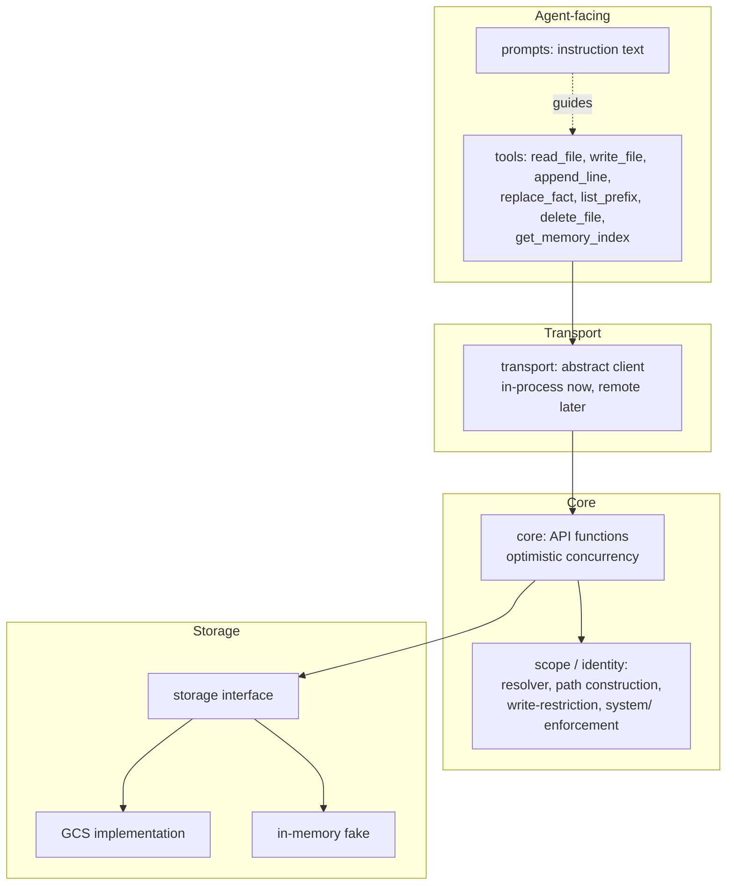

# Architecture

## Bird's-eye view

wenchang gives an AI agent persistent memory: a virtual filesystem of
markdown files, addressed by `{root}/{scope}/{entity_id}/{area}/{name}.md`,
exposed to the agent through a small set of tools (`read_file`, `write_file`,
`append_line`, `replace_fact`, `list_prefix`, `delete_file`,
`get_memory_index`). The library supplies mechanism — storage, concurrency,
authorization — and prompt text describing how to use it well; it enforces
no schema and does not search file content.

Today the repository holds the project skeleton (tooling, tests, docs) plus
six implemented modules: the cross-cutting `errors` and `version_token`; the
dependency-free `file_format` and `paths`; the `storage` layer (an in-memory
fake and a GCS implementation behind one protocol); and `core`, whose
implemented operations so far are `read_file`, `write_file`, `replace_fact`,
`list_prefix`, and `append_line`. The module map below is the intended
shape; each remaining module is marked **(planned)** until implemented.

## Module map

- **errors** — the exception hierarchy every core API function will raise:
  `WenchangError` (base) and one class per category —
  `RecoverableError`, `PermanentError`, `TransientError` — each fixing that
  category's next-action guidance text. Concrete kinds: recoverable
  `VersionConflictError`, `OversizeWriteError`, `ReplaceFactMatchError`,
  `NotFoundError`; permanent `RestrictedScopeError`, `ResolverFailureError`;
  transient `BackendUnavailableError`. See
  [Cross-cutting: error taxonomy](#cross-cutting-error-taxonomy) and
  [ADR 0005](docs/adr/0005-error-taxonomy-as-exceptions.md).
- **version_token** — `VersionToken`, an opaque `NewType` over `str` used
  wherever a caller needs to prove which version of a file it read.
- **file_format** — parsing and serializing a memory file's body and
  metadata, with no dependency on storage, transport, scope, or agent
  frameworks; used by `core` and `storage`. `ConfidenceLabel` (the four
  labels) and `Fact` (label + single-line text), with `parse_fact` /
  `format_fact` converting a single line. `BodyLine` (`Fact | str`) with
  `parse_body` / `serialize_body` converting a whole body losslessly,
  keeping non-fact lines verbatim. `FileMetadata` (description, aliases,
  sources, last-updated) with `metadata_to_map` / `metadata_from_map`
  converting to and from the flat string map stored as GCS custom object
  metadata; malformed input raises `MetadataFormatError`. See
  [ADR 0006](docs/adr/0006-file-format-and-metadata-encoding.md).
- **paths** — `is_valid_path(path)`, a syntactic check for
  `{scope}/{entity_id}/{area}/{name}.md`: exactly four non-empty segments,
  none `.` or `..`, none containing a backslash or a Unicode control
  character, the last ending in `.md` with a non-empty stem. Paths are
  relative to the storage root; the check never inspects storage or
  interprets the segments (scope validity, authorization) — see [ADR
  0007](docs/adr/0007-core-api-shape-and-storage-layer.md).
  `is_valid_prefix(prefix)` checks 1-3 valid segments (the same segment
  rule as `is_valid_path`), each followed by `/`; the empty prefix is
  invalid. Neither function ever raises or inspects storage.
- **storage** — an internal protocol mirroring GCS object semantics (custom
  metadata, a generation-backed version token): `Storage` (`get`, `put`,
  `put_if_version`, `list_page`) and `StoredObject` (bytes, metadata map,
  `VersionToken`), with two implementations behind it, held identical by one
  shared conformance suite. `InMemoryStorage` is the unit-test fake.
  `GcsStorage` is the only module that imports `google.cloud`; it maps
  client timeouts and server/connection unavailability to
  `BackendUnavailableError`, and pins each `get` to the generation
  `get_blob` fetched so content and metadata always come from the same
  write, retrying on a generation race. `put` is unconditional in both
  implementations. `put_if_version(key, data, metadata, expected)` is the
  conditional put: `expected=None` commits only if no object exists at
  `key` (GCS `ifGenerationMatch=0`); a token commits only if it equals the
  object's current version; any other case raises the storage-internal
  `PreconditionFailedError(key)` and writes nothing. Tokens are compared by
  string equality in `InMemoryStorage`; `GcsStorage` accepts only the
  canonical decimal form of a positive integer as a token (so `"0"` and
  other non-canonical strings fail the precondition locally, with no client
  call, rather than being read as "must not exist"). `list_page(prefix,
  start_after, limit)` returns `ListedObject(key, metadata, version)` for
  keys starting with `prefix` (plain string match), ascending by key, at
  most `limit`, strictly after `start_after` when given (exclusive), never
  reading object bodies; metadata mappings are copies. `InMemoryStorage`
  sorts and slices in memory; `GcsStorage` uses `list_blobs(prefix=...,
  start_offset=start_after, max_results=limit + 1)`, dropping a key equal to
  `start_after` (GCS's `start_offset` is inclusive) before truncating to
  `limit`; call and iteration errors go through the same
  `_map_backend_error` as the rest of `GcsStorage`. See
  [ADR 0003](docs/adr/0003-storage-interface-with-in-memory-fake-and-gcs-emulator.md),
  [ADR 0007](docs/adr/0007-core-api-shape-and-storage-layer.md),
  [ADR 0008](docs/adr/0008-conditional-put-and-write-file-semantics.md), and
  [ADR 0010](docs/adr/0010-list-prefix-pagination.md).
- **core** — `MemoryStore(storage, *, max_file_bytes=16384, clock=...,
  list_page_size=100)`,
  holding the core API as methods on one object (so later operations can
  share configuration such as a size limit or index cap); `max_file_bytes`
  must be positive, `clock` (default current UTC) is injectable for tests
  and for stamping `last-updated`, and `list_page_size` (default
  `DEFAULT_LIST_PAGE_SIZE = 100`) must be positive, bounding
  `list_prefix`'s page size. `read_file(path) -> MemoryFile` is
  implemented: it validates the path, fetches the object, and returns
  content, metadata, path, and version token. `write_file(path, content,
  metadata, expected_version) -> MemoryFile` is implemented: it validates
  the path, rejects content whose UTF-8 encoding exceeds `max_file_bytes`
  with `OversizeWriteError` (checked before storage is consulted), stamps
  `metadata.last_updated` from the clock (overriding the caller's value),
  and issues one conditional put. On a precondition failure it fetches the
  current object and raises `VersionConflictError(path, current_content,
  current_version)`, or `NotFoundError(FILE_ABSENT)` if the file is now
  absent; a corrupt object found on that fetch raises `MetadataFormatError`
  or `UnicodeDecodeError` exactly as `read_file` does. `replace_fact(path,
  old_string, new_string, expected_version, *, source) -> MemoryFile` is
  implemented: it changes one span of a file's content without the caller
  resending the rest. `old_string` must match a unique anchor — every start
  index counts, so overlapping occurrences (e.g. `"aa"` in `"aaa"`) count
  separately. It reads the current object, counts occurrences of
  `old_string`, and compares that count to 1: at the caller's own
  `expected_version`, any count other than 1 raises
  `ReplaceFactMatchError(path, content, version, count)`; at a stale
  version, a unique match re-applies the edit against the current content
  (absorbing a concurrent write elsewhere in the file), while a non-unique
  match — "genuine overlap," meaning the anchor no longer matches exactly
  once — raises `VersionConflictError(path, content, version)` instead. The
  conditional put is guarded on the version just read, not the caller's
  `expected_version`; a `PreconditionFailedError` re-reads and repeats the
  same check, up to 3 attempts total, after which `VersionConflictError`
  carries the last-read content and version. On success, metadata is
  carried over from the object read on the attempt that commits, with
  `source` unioned into `sources` and `last_updated` stamped from the
  clock; `old_string == ""` or `source == ""` raises `ValueError` before
  storage is consulted. `list_prefix(prefix, cursor=None) -> ListPage` is
  implemented: it returns one page of well-formed memory files under a
  segment-aligned `prefix` as `FileEntry(path, metadata, version)`, in
  ascending path order, without reading any file's content. An invalid
  `prefix` raises `NotFoundError(prefix, INVALID_PATH)` without consulting
  storage. It fetches `list_page_size + 1` keys from `Storage.list_page`
  (decoding `cursor` to a `start_after` key first, if given) so it can tell
  whether a key remains after the page; `ListPage.next_cursor` is `None`
  iff none does. A key under the prefix that isn't a well-formed memory
  path is skipped, so a page can hold fewer than `list_page_size` entries
  while `next_cursor` is still non-`None`; corrupt metadata on a
  well-formed key raises `MetadataFormatError`, and
  `BackendUnavailableError` propagates, exactly as in `read_file`. A
  `ListCursor` is an opaque, URL-safe-base64 encoding of the last key
  examined, validated on decode against the `prefix` it's passed with; a
  malformed cursor or one issued for a different prefix raises `ValueError`.
  Listing is not a snapshot: a file written or deleted between two pages of
  the same listing is reflected at whatever page reads it (or not at all,
  if deleted before its page). `append_line(path, line, expected_version, *,
  source) -> MemoryFile` is implemented: it appends one fact line to the end
  of an existing file's content, only if the file is still at
  `expected_version`. It reads the current object, checks the version,
  inserts a `"\n"` separator first if the content is non-empty and doesn't
  already end in one, and issues one conditional put; `line` must parse as
  exactly one fact line (`parse_fact`) or `ValueError` is raised before
  storage is consulted, as does an empty `source`. A stale `expected_version`
  raises `VersionConflictError(path, current_content, current_version)`
  immediately — unlike `replace_fact`, there is no automatic re-apply,
  since re-applying an append always succeeds and would duplicate a landed
  line on retry. A `PreconditionFailedError` re-reads; if the stored bytes
  and metadata already equal exactly what this call tried to write (its own
  write landed and a backend-level retry of the conditional upload then saw
  the precondition fail), it returns that as success rather than raising or
  writing again, otherwise it raises `VersionConflictError` with the
  current content and version, or `NotFoundError(FILE_ABSENT)` if the
  object is now gone. A missing file raises `NotFoundError(FILE_ABSENT)`
  and is never created. Metadata is stamped the same way as `replace_fact`:
  `source` unioned into `sources`, `last_updated` from the clock, other
  fields unchanged. `delete_file` and `get_memory_index` are *(planned)*.
  See
  [ADR 0007](docs/adr/0007-core-api-shape-and-storage-layer.md),
  [ADR 0008](docs/adr/0008-conditional-put-and-write-file-semantics.md),
  [ADR 0009](docs/adr/0009-replace-fact-semantics.md),
  [ADR 0010](docs/adr/0010-list-prefix-pagination.md), and
  [ADR 0011](docs/adr/0011-append-line-version-guard.md).
- **scope / identity** *(planned)* — the injected identity resolver
  interface (credentials → scope-to-entity-ID map + role per scope), path
  construction, and write-restriction / `system/`-read-only enforcement.
- **transport** *(planned)* — an abstract client interface mirroring the
  core API, with an in-process implementation now and a remote (gRPC)
  implementation later. In-process and remote implementations must be
  behaviorally indistinguishable, verified by a shared conformance suite.
- **tools** *(planned)* — the agent-facing tool layer: thin wrappers over
  the transport client, carrying no policy, each described by a docstring.
- **prompts** *(planned)* — instruction text for filing, deduplication,
  alias upkeep, confidence calibration, write mechanics, curated-content
  correction, applying memory, forgetting, and privacy, plus the
  adopter-configurable slots (scope guidance, seed areas, scope priority,
  systems of record).

```mermaid
flowchart TB
    subgraph Agent-facing
        prompts[prompts: instruction text]
        tools[tools: read_file, write_file, append_line,\nreplace_fact, list_prefix, delete_file,\nget_memory_index]
    end
    subgraph Transport
        transport[transport: abstract client\nin-process now, remote later]
    end
    subgraph Core
        core[core: API functions\noptimistic concurrency]
        scope[scope / identity:\nresolver, path construction,\nwrite-restriction, system/ enforcement]
    end
    subgraph Storage
        storageiface[storage interface]
        gcs[GCS implementation]
        fake[in-memory fake]
    end

    prompts -.guides.-> tools
    tools --> transport
    transport --> core
    core --> scope
    core --> storageiface
    storageiface --> gcs
    storageiface --> fake
```

`errors` and `version_token` are cross-cutting (imported by every layer
above) and are omitted from the diagram to keep it readable. `file_format`
is dependency-free and used by `core` and `storage`; it is also omitted
from the diagram since it isn't wired into the request path shown there.

## Key invariants

- **Optimistic concurrency via generation.** Every mutating call carries an
  expected version token; a stale token fails the call and returns current
  content plus current version so the caller can merge and retry in the
  same turn. The version token is opaque — no caller parses, compares, or
  orders it. `write_file`'s `expected_version=None` means "create; must not
  exist," the one mutating case with no prior token to hold; a non-`None`
  token against an absent file is `NotFoundError(FILE_ABSENT)`, not a
  conflict, since there is no current content to return. Storage signals a
  failed precondition with its own `PreconditionFailedError`, an internal
  signal never surfaced to agents; `core` translates it into
  `VersionConflictError` by fetching the current object. An unrecognized or
  non-numeric token is treated as a mismatch (conflict), never a parse
  error — callers cannot be asked to supply well-formed tokens since they
  never parse them. `replace_fact` re-applies a unique anchor match against
  a newer version (absorbing a concurrent write elsewhere in the file);
  `append_line` does not — a stale token always surfaces immediately as
  `VersionConflictError`, since re-applying an append always succeeds and
  would duplicate a landed line on retry (see
  [ADR 0011](docs/adr/0011-append-line-version-guard.md)).
- **One lock, one token per file.** Content and metadata commit together;
  there is no metadata-only update.
- **A per-file byte ceiling bounds writes, not reads.** `write_file` rejects
  content whose UTF-8 encoding exceeds the store's `max_file_bytes` (default
  16384, configurable, exactly the limit allowed) before consulting storage;
  the ceiling counts content bytes only, never metadata.
- **`last-updated` is stamped by `core`, not the caller.** Every write path
  sets `metadata.last_updated` from the store's injectable clock, overriding
  whatever the caller supplied, so the field stays reliable for index
  ordering without every caller having to remember to refresh it.
- **The `system/` area is read-only to the agent**, enforced at the tool
  layer as an exact path-prefix check, not by instruction.
- **Metadata-only navigation.** `description` and `aliases` are the entire
  search surface; there is no content search over file bodies.
- **Listing never reads content and is not a snapshot.** `list_prefix` and
  the `Storage.list_page` primitive beneath it return keys, metadata, and
  version tokens only, never object bodies; a listing spans multiple pages
  without pinning storage to one point in time, so a file's absence from a
  page means only that it wasn't present when that page was read.
  Prefixes are segment-aligned (1-3 of the path's four segments, each
  followed by `/`); listing recurses through every deeper segment beneath
  the prefix given.
- **Metadata rides beside the body, never inside it.** The four metadata
  fields are stored as flat string object custom metadata attached to the
  file, committed atomically with the body; the markdown body itself is
  fact lines and tolerated non-fact lines only. The body parser is
  lossless: `serialize_body(parse_body(s)) == s` for every string `s`.
- **The storage root is the storage instance.** `{root}` in the path layout
  is one storage instance — for GCS, one bucket — and every path a caller
  gives `core` is relative to it; the storage protocol takes that path as
  its key unchanged. A key prefix within a bucket, if ever needed, is
  addable without changing callers.
- **Version tokens convert to and from a GCS generation in exactly one
  place.** The `Storage` protocol and every caller above it speak
  `VersionToken` only; `GcsStorage` is the sole module that turns a token
  into (or out of) an integer generation.

## Cross-cutting: error taxonomy

Errors are categorized by what the agent should do next, not by underlying
cause. Defined in `wenchang.errors` (see [ADR
0005](docs/adr/0005-error-taxonomy-as-exceptions.md)):

- **Recoverable** (`RecoverableError`) — the error carries its own repair
  material (e.g. `VersionConflictError` returns current content and
  version; `OversizeWriteError` returns current size and limit;
  `ReplaceFactMatchError` returns content, version, and match count;
  `NotFoundError` distinguishes an invalid path from a valid path with no
  file yet). The agent corrects and retries in the same turn.
- **Permanent** (`PermanentError`) — stop, do not retry
  (`RestrictedScopeError` for a `system/` write or a role-gated scope;
  `ResolverFailureError` for identity resolution failure).
- **Transient** (`TransientError`) — retry is appropriate
  (`BackendUnavailableError`, distinguishing timeout from unavailability); a
  version-guarded retry safely degrades to a recoverable version conflict if
  the first attempt actually landed.

This taxonomy is expected to apply uniformly across the core API, the
transport layer, and tool-facing error messages.
